# Introduction

## Project overview

For this project sales and marketing data from a multi-channel company were provided. The data cover the company's retail stores, catalog and website and detail customer records, marketing contacts, orders, and line item records.

This project used these data to investigate various marketing techniques used by this company in order to understand their effectiveness. A specific focus was placed upon email vs. catalog marketing. 

## This document

This document is split in to three distinct sections, A, B and C. Section A covers our exploratory data analyses as we seek to profile the data and understand both its sales and its marketing activity. In section B we apply traditional Recency Frequency Monetary ("RFM") segmentation to the data. Section C extends section B based on the results found in section A, adding a further dimension to the RFM model.

The `SQL` and `R` code used to perform these analyses has been provided as supplementary files, and sections of the `R` code can be viewed in this report using the _Code_ buttons to toggle code viewing.

```{r prep, echo = TRUE, message=FALSE}
# Load packages
library(dplyr)
library(RPostgreSQL)
library(tidyr)
library(ggplot2)
library(igraph)
library(networkD3)
library(knitr)
library(broom)
library(readr)

# Set up connection to the Postgres database
db <- src_postgres(dbname = "dm")

# Set up theme object for prettier plots
theme_jim <-  theme(legend.position = "bottom",
    axis.text.y = element_text(size = 16, colour = "black"),
    axis.text.x = element_text(size = 16, colour = "black"),
    legend.text = element_text(size = 16),
    legend.title = element_text(size = 16),
    title = element_text(size = 16),
    strip.text = element_text(size = 16, colour = "black"),
    strip.background = element_rect(fill = "white"),
    panel.grid.minor.x = element_blank(),
    panel.grid.major.x = element_line(colour = "grey", linetype = "dotted"),
    panel.grid.minor.y = element_line(colour = "lightgrey", linetype = "dotted"),
    panel.grid.major.y = element_line(colour = "grey", linetype = "dotted"),
    panel.margin.y = unit(0.1, units = "in"),
    panel.background = element_rect(fill = "white", colour = "lightgrey"),
    panel.border = element_rect(colour = "black", fill = NA))

# Source the data from the database
lines <- tbl(db, "lines_clean")
orders <- tbl(db, "orders_clean")
contacts <- tbl(db, "contacts_clean")
sum_tabl <- tbl(db, "summary_table")

# Function that takes a string and converts it in to "proper case" (i.e.
# the first letter is capitalised, all remaining letters are lower case)
# N.b. for multi-word strings, only the first word will be affected
toproper <- function(x) { 
  first <- substring(x, 1, 1) %>% toupper()
  rest <- substring(x, 2) %>% tolower()
  whole <- paste0(first, rest)
  return(whole)
}
```

# Section A - Exploratory Analysis

## Section A1 - Response rates

```{r response_rates, message = FALSE, eval = FALSE}
#Create a table called 'rates' to capture response rates over time.
rates <- data.frame(season = c('07Fall',
                               '07Spr',
                               '06Fall',
                               '06Spr',
                               '05Fall',
                               '05Spr',
                               '04Fall',
                               '04Spr'))

# Set up specific start and end dates for the seasons
rates <- cbind(rates, startDate = as.Date(c('2007-07-01', 
                                            '2007-01-01',
                                            '2006-07-01',
                                            '2006-01-01',
                                            '2005-07-01',
                                            '2005-01-01',
                                            '2004-07-01',
                                            '2004-01-01'),
                                          format="%Y-%m-%d"))

rates <- cbind(rates, endDate = as.Date(c('2007-12-31',
                                          '2007-06-30',
                                          '2006-12-31',
                                          '2006-06-30',
                                          '2005-12-31',
                                          '2005-06-30',
                                          '2004-12-31',
                                          '2004-06-30'),
                                        format="%Y-%m-%d"))

# Set up empty fields to hold results later
rates$numberEmailed <- NA
rates$numberResponded <- NA
rates$E_responseRate <- NA
rates$numberCatalogued <- NA
rates$numberCatResponded <- NA
rates$C_responseRate <- NA

# Fill in 'numberEmailed' column, the number of people who were emailed during that season.
# And Fill in 'numberResponded' column, the number of people 
# who were emailed and bought things in that seasond
for(i in 1:nrow(rates)) {
    
srtdate <- rates$startDate[i]
enddate <- rates$endDate[i]

#get Cust_ids who were emailed within each season from contacts table.
aa <- filter(contacts, 
             ContactDate %in% seq(srtdate,enddate, "day"), 
             ContactType=="E")

#since many of those ids are repeated, I only want the unique ones.
ids_emailed <- select(aa, Cust_ID) %>% unique() 

# From that subset of unique ids who bought during each season?
bb <- filter(orders,
             Cust_ID %in% ids_emailed[,1], 
             OrderDate %in% seq(srtdate,enddate, "day"))

# Insert results into columns.
rates$numberEmailed[i] <-ids_emailed %>% count()
rates$numberResponded[i] <- select(bb, Cust_ID) %>% 
                            unique() %>% 
                            count()
}

rates$numberEmailed <- as.numeric(rates$numberEmailed)
rates$numberResponded <- as.numeric(rates$numberResponded)
rates$E_responseRate <- round((rates$numberResponded/rates$numberEmailed)*100,
                              2)


#Same method as above, but now for Catalogues:
for(i in 1:nrow(rates)) {
    
srtdate <- rates$startDate[i]
enddate <- rates$endDate[i]

aa <- filter(contacts, 
             ContactDate %in% seq(srtdate, enddate, "day"), 
             ContactType=="C")

ids_Catalogued < -select(aa, Cust_ID) %>% unique() 

bb <- filter(orders,
             Cust_ID %in% ids_Catalogued[,1], 
             OrderDate %in% seq(srtdate,enddate, "day"))

rates$numberCatalogued[i] <-ids_Catalogued %>% count()
rates$numberCatResponded[i] <- select(bb,Cust_ID) %>% 
                                unique() %>% 
                                count()
}

rates$numberCatalogued <- as.numeric(rates$numberCatalogued)
rates$numberCatResponded <- as.numeric(rates$numberCatResponded)
rates$C_responseRate <-round((rates$numberCatResponded/rates$numberCatalogued)*100,
                             2)
```

```{r get_rates, include = FALSE}
rates <- readr::read_csv("./jon/rates.csv")
```

Response rates were calculated for customers emailed and sent catalogues. This was done at a season level, looking at Spring vs. Autumn ("Fall") response rates across the data. The results are presented in the table below.

```{r show_rates}
rates %>% 
    select(season, startDate, endDate, responseRate, C_responseRate) %>% 
    arrange(startDate) %>% 
    na.omit() %>% 
    kable(col.names = c("Season", "Start", "End", "Email Response Rate",
                        "Catalogue Response Rate"))
```

We visualised these results and present them in figures one and two below.

```{r show_email, out.width = 600, out.height= 600, fig.retina = NULL, fig.align='center', fig.cap="Figure 1: Email Marketing Customer Response Rates By Season"}
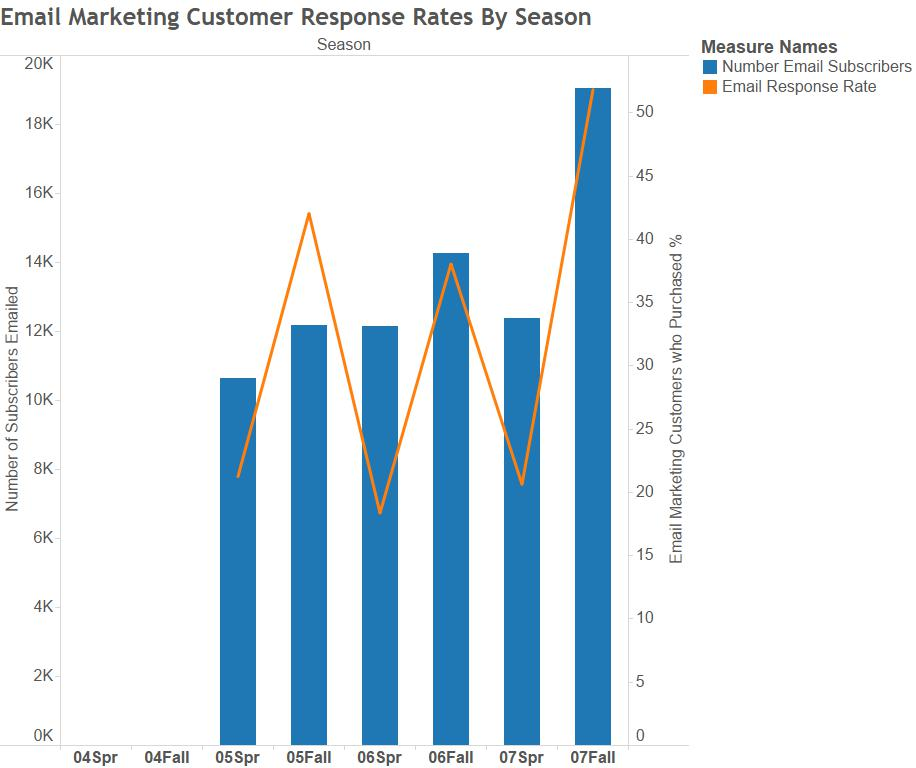
```

Figure one shows the email marketing response rates for customers who were sent at least one marketing email in the season (lasting 6 months). They are counted as having responded if they have bought at least 1 item from the shop in that season through any channel (online order, in shop, or by phone).

The blue bars show that the company have increased the number of email addresses on their subscription list. The orange line peaking every Fall likely occurs due to the natural increase in sales that take place in December (as noted in the data description). However, this seasonal spike might also be due to customer’s increased responsiveness to marketing, as customers are already shopping heavily in that period and will respond to marketing more readily.

```{r show_cat, out.width = 600, out.height= 600, fig.retina = NULL, fig.align='center', fig.cap="Figure 2: Catalogue Marketing Customer Response Rates By Season"}
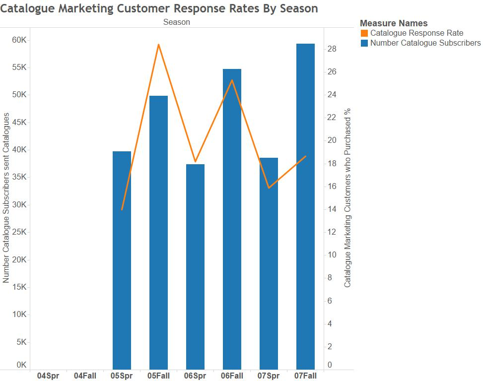
```

Figure two shows the catalogue marketing response rates for customers who were sent at least one catalogue in the season. They are counted as having responded if they have bought at least 1 item from the shop in that season through any channel.

The company sends out broadly consistent numbers of catalogues each spring. They also send more each Fall period. Catalogue response rates show a decreasing trend across the Fall periods. This is perhaps because a consistent consumer base who respond to catalogue marketing have been saturated in the number of catalogues being sent out, leading to a fall in the response rate. Or perhaps catalogue marketing is becoming less effective compared to other forms, such as digital. 

## Section A2 - Spending based on order method

We also looked at sales split down by the different order methods in order to understand the customers' purchasing habits. There are four types of order in the data: internet (I), store (ST), phone (P), and mail (m). Summarising total orders (by items and spend) for these order types generates the summary table below.

```{r order_type_summary}
order_type_summary <- lines %>% 
    group_by(ordernum) %>% 
    summarise(items = n(),
              spend = sum(line_dollars)) %>% 
    inner_join(orders, by = c("ordernum" = "ordernum")) %>% 
    group_by(order_method) %>% 
    summarise(items_purchased = sum(items),
              total_spend = sum(spend)) %>% 
    collect() %>% 
    mutate(order_method = gsub("M", "Mail", order_method),
           order_method = gsub("I", "Internet", order_method),
           order_method = gsub("P", "Phone", order_method),
           order_method = gsub("ST", "Store", order_method))

order_type_summary %>% 
    kable(col.names = c("Order method", "Items purchased", "Total spend (£)"),
          format.args = list(big.mark = ','),
          digits = 0)
```

Whilst store-based sales dominated in terms of items purchased, both phone and internet sales show strong figures for total spend, perhaps indicating an increased consumer preference to make larger orders via those media.

```{r order_type_regression}
method_fit <- lines %>% 
    group_by(ordernum) %>% 
    summarise(items = n(),
              spend = sum(line_dollars)) %>% 
    inner_join(orders, by = c("ordernum" = "ordernum")) %>% 
    collect() %>% 
    mutate(order_method = gsub("M", "Mail", order_method),
           order_method = gsub("I", "Internet", order_method),
           order_method = gsub("P", "Phone", order_method),
           order_method = gsub("ST", "Store", order_method),
           order_method = as.factor(order_method)) %>% 
    lm(spend ~ order_method, data = .)

method_tidy <- tidy(method_fit)
method_glance <- glance(method_fit)
```

In order to understand the statistical effect that order method has on spend, we performed a simple regression of order spend (£) on order method. The results of this regression are presented in the tables below.

```{r show_fit}
kable(method_tidy, 
      col.names = c("Term", "Estimate", "Std. Error", "t-Stat.", "p-Value"),
      digits = 3)
```

```{r show_fit_stats}
method_glance %>% select(2, 3, 4, 5, 6, 8) %>% 
kable(col.names = c("Adjusted R-Squared", "Sigma",
                                   "F-Stat.", "p-Value", "Deg. Freedom",
                                   "AIC"),
      digits = 3)
```

As can be seen from the results of the regression, mail and phone orders are likely to increase the order spend relative to internet-based orders, whilst store orders are likely to be less valuable. These results are statistically significant. However, the overall model fit is exceptionally poor (R^2^ of just `r round(summary(method_fit)$r.squared, 3)`). This leads us to conclude that order type is not particularly useful in explaining order spend. Therefore a customer's order type preference should probably not inform our choice of how to market to customers.

## Section A3 - Store distance and sales

```{r generate_siang_data, eval = FALSE}
#Remove line with no distance data
new_summary <- summary %>% filter(!is.na(StoreDist))

#Calculate subtotal of dollar spent
line_gift <- lines %>% filter(Gift == "Y")
line_nogift <- lines %>% filter(Gift == "N")
line_retail <- lines %>% filter(is.na(Gift))
sum_gift <- line_gift %>% group_by(Cust_ID) %>% summarise(sum_dollar_gift = sum(LineDollars, na.rm = TRUE))
sum_nogift <- line_nogift %>% group_by(Cust_ID) %>% summarise(sum_dollar_nongift = sum(LineDollars, na.rm = TRUE))
sum_retail <- line_retail %>% group_by(Cust_ID) %>% summarise(sum_dollar_retail = sum(LineDollars, na.rm = TRUE))

#Aggregate data on ID level
totalspendbyID <- lines %>% group_by(Cust_ID) %>% summarise(sum_dollar_total = sum(LineDollars, na.rm = TRUE))
storedistancebyID <- new_summary %>% select(Cust_ID,StoreDist)
ordermethodbyID <- read_csv("./Siang/data/order_method.csv",col_names = TRUE,col_types = NULL,skip=0)
paymentmethodbyID <- read_csv("payment_method.csv",col_names = TRUE,col_types = NULL,skip=0)

#Join datasets by ID
data<- left_join(totalspendbyID,sum_gift,by = "Cust_ID")
data<- left_join(data,sum_nogift,by = "Cust_ID")
data<- left_join(data,sum_retail,by = "Cust_ID")
data<- left_join(data,storedistancebyID,by = "Cust_ID")
data<- left_join(data,ordermethodbyID,by = "Cust_ID")
data<- left_join(data,paymentmethodbyID,by = "Cust_ID")
```

```{r get_siang_data, include = FALSE}
data <- readr::read_csv("./Siang/resources/data.csv",
                 col_names = TRUE,
                 col_types = NULL,
                 skip=0)
attach(data)
```

In this section we examined if a customers' store distance affected their spending and their order methods. Figure three shows the average distance from the customer’s address to the nearest company store and the results were broken down by the type of their order methods. Comparing to the channels of internet, mail and phone, customers who purchase products via retail channel (store) generally have an address that is nearest to the store. Customers who purchase through mail via catalog channel have the highest average store distance. Overall, customers who do not purchase directly at the retail store live relatively far away from their nearest company store.

```{r, echo=FALSE, out.width = 200, out.height= 200, fig.retina = NULL, fig.align='center', fig.cap="Figure 3: Average Store Distance (miles)"}
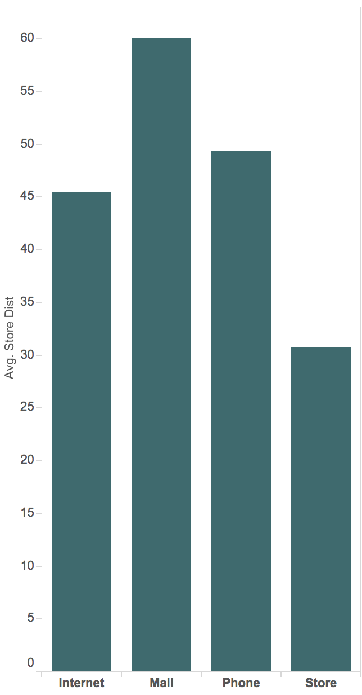
```

## Spend based on distance {.tabset .tabset-fade}

The total spend of each customer was calculated to investigate the relationship between store distance and the total amount of money they spent on the products. Extending the work performed in section A2, the amount of money spent was split into different order channels: retail store, internet, mail and phone. Phone and mail are the two methods by which catalog channel orders are placed. Linear regression and scatter plots were employed to investigate the relationship and identify potential trends.

Results for all four scenarios are similar. Although the p-values of store distance in all four models are very significant, the R-squared and estimate are zero or near-zero. That implies the independent variable - store distance might be statistically significant but it is not economically significant at all, which was also supported by the scatter plots where no trend is observed.

### Internet

```{r internet_mod}
model211 <- lm(sum_dollar_internet ~ StoreDist)
```

```{r internet_graph, out.width = 300, out.height= 300, fig.retina = NULL, fig.align='center', fig.cap="Figure 4: Sum of spending via internet"}
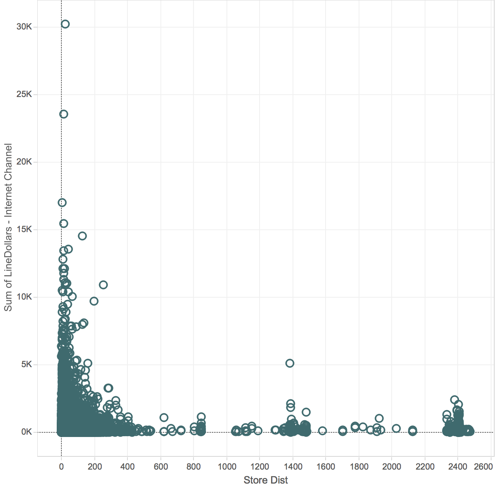
```

```{r show_internet_model}
kable(tidy(model211), col.names = c("Term", "Estimate", "Std. Error", "t-Stat.", "p-Value"), digits = 3)
kable(glance(model211), col.names = toproper(glance(model211) %>% names()), digits = 3)
```

### Retail store

```{r store_model}
model212 <- lm(sum_dollar_retail ~ StoreDist)
```

```{r store_graph, out.width = 300, out.height= 300, fig.retina = NULL, fig.align='center', fig.cap="Figure 5: Sum of spending via retail store"}
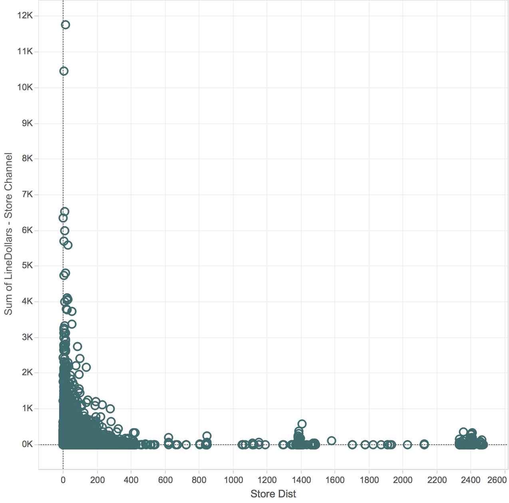
```

```{r show_store_model}
kable(tidy(model212), col.names = c("Term", "Estimate", "Std. Error", "t-Stat.", "p-Value"), digits = 3)
kable(glance(model212), col.names = toproper(glance(model212) %>% names()), digits = 3)
```

### Mail

```{r mail_model}
model213 <- lm(sum_dollar_mail~StoreDist)
```

```{r mail_graph, out.width = 300, out.height= 300, fig.retina = NULL, fig.align='center', fig.cap="Figure 6: Sum of spending via catalog (Mail)"}
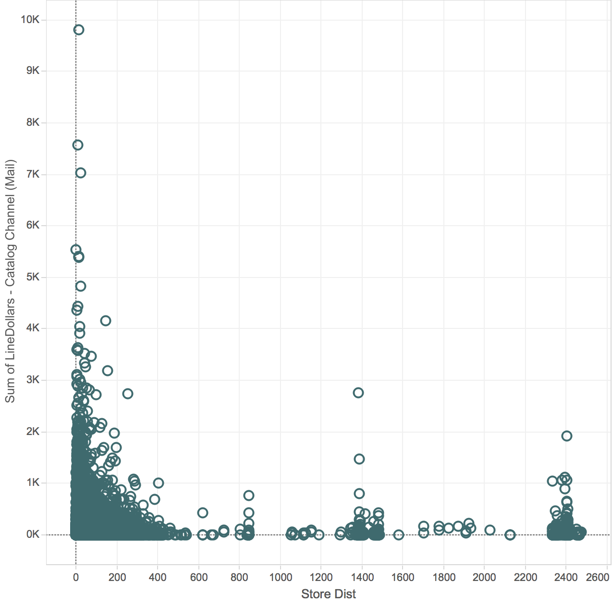
```

```{r show_mail_model}
kable(tidy(model213), col.names = c("Term", "Estimate", "Std. Error", "t-Stat.", "p-Value"), digits = 3)
kable(glance(model213), col.names = toproper(glance(model213) %>% names()), digits = 3)
```

### Phone

```{r phone_model}
model214 <- lm(sum_dollar_phone~StoreDist)
```

```{r phone_graph, out.width = 300, out.height= 300, fig.retina = NULL, fig.align='center', fig.cap="Figure 7: Sum of spending via catalog (Phone)"}
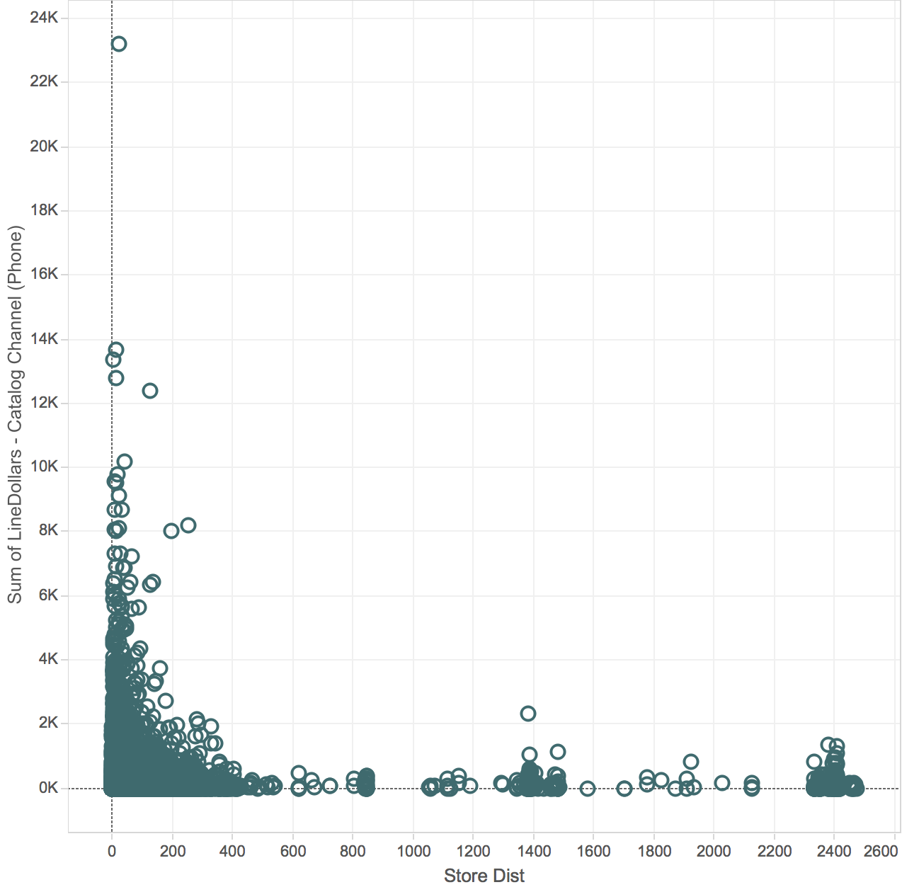
```

```{r show_phone_model}
kable(tidy(model214), col.names = c("Term", "Estimate", "Std. Error", "t-Stat.", "p-Value"), digits = 3)
kable(glance(model214), col.names = toproper(glance(model214) %>% names()), digits = 3)
```

## Frequency of purchase {.tabset .tabset-fade}

A new attempt to investigate the relationship between customer spending and store distance was made, the variable of dollar spent was replaced with frequency of purchase made by customers. The identical methodology and data segmentation was used for the following analysis, using linear regression and scatter plots to investigate the relationship and identify potential trends.

Similar to the results from part 1, the variable store distance is not economically significant in all four scenarios. Term estimates and R^2^ values are very low in each case. Therefore, it can be concluded that there is no direct relationship between store distance and frequency of customer shopping, that is, customers do not shop more frequently based on the store distance.

### Internet

```{r internet_freq_mod}
model224 <- lm(frequency_internet~StoreDist)
```

```{r out.width = 300, out.height= 300, fig.retina = NULL, fig.align='center', fig.cap="Figure 8: Frequency of purchase via internet"}
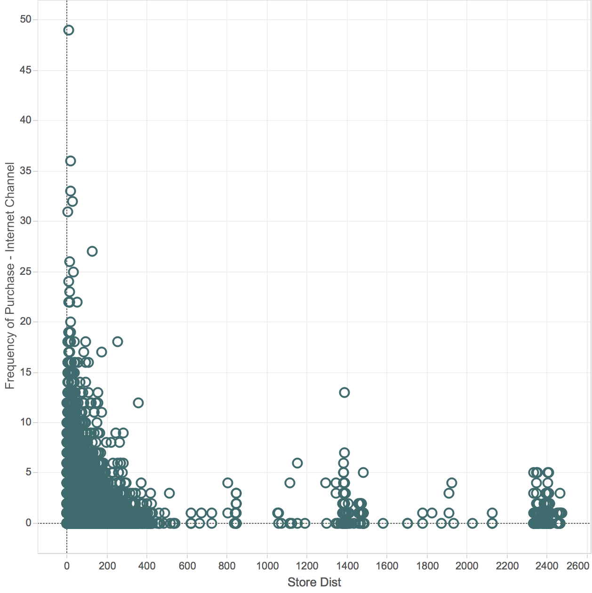
```

```{r, echo=FALSE}
kable(tidy(model224), col.names = c("Term", "Estimate", "Std. Error", "t-Stat.", "p-Value"), digits = 3)
kable(glance(model224), col.names = toproper(glance(model224) %>% names()), digits = 3)
```

### Retail store

```{r ret_freq_mod}
model221 <- lm(frequency_store~StoreDist)
```

```{r out.width = 300, out.height= 300, fig.retina = NULL, fig.align='center', fig.cap="Figure 9: Frequency of purchase via retail store"}
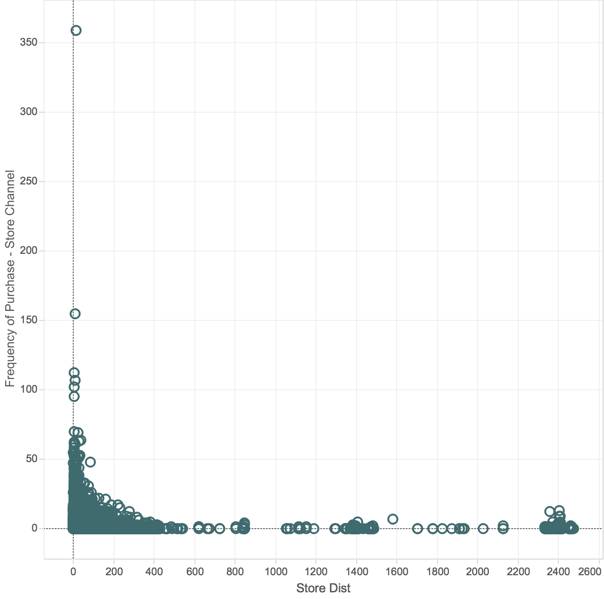
```

```{r}
kable(tidy(model221), col.names = c("Term", "Estimate", "Std. Error", "t-Stat.", "p-Value"), digits = 3)
kable(glance(model221), col.names = toproper(glance(model221) %>% names()), digits = 3)
```

### Mail

```{r}
model223 <- lm(frequency_mail~StoreDist)
```

```{r, echo=FALSE, out.width = 300, out.height= 300, fig.retina = NULL, fig.align='center', fig.cap="Figure 10: Frequency of purchase via mail"}
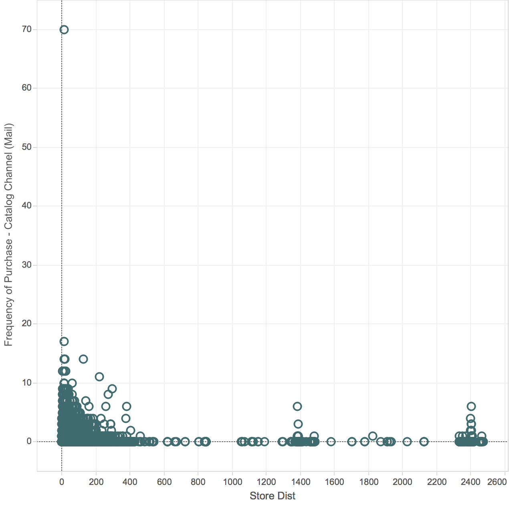
```

```{r}
kable(tidy(model223), col.names = c("Term", "Estimate", "Std. Error", "t-Stat.", "p-Value"), digits = 3)
kable(glance(model223), col.names = toproper(glance(model223) %>% names()), digits = 3)
```

### Phone

```{r}
model222 <- lm(frequency_phone~StoreDist)
```

```{r out.width = 300, out.height= 300, fig.retina = NULL, fig.align='center', fig.cap="Figure 11: Frequency of purchase via phone"}
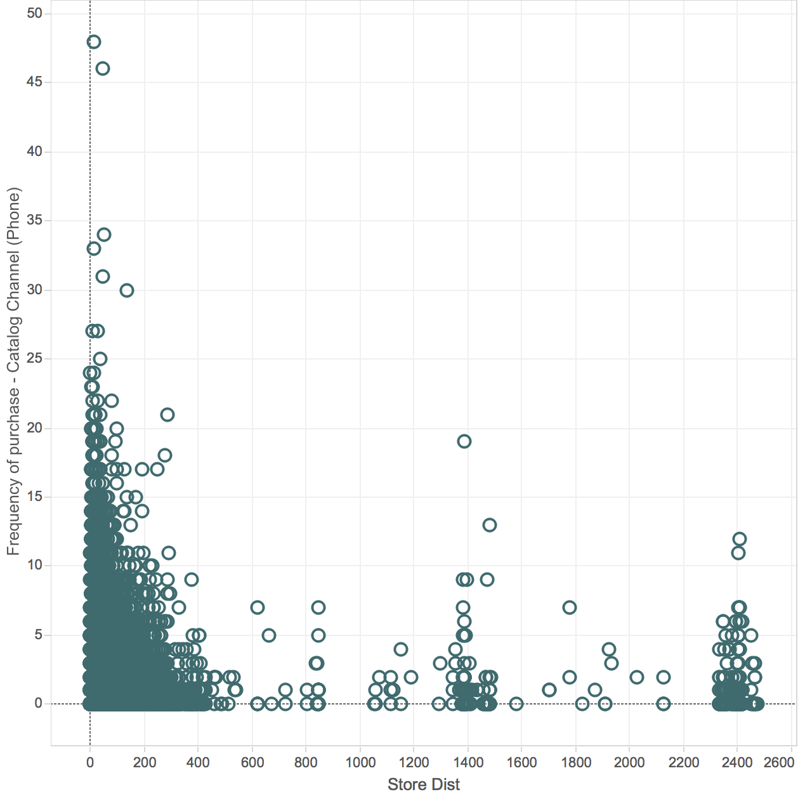
```

```{r}
kable(tidy(model222), col.names = c("Term", "Estimate", "Std. Error", "t-Stat.", "p-Value"), digits = 3)
kable(glance(model222), col.names = toproper(glance(model222) %>% names()), digits = 3)
```

## A3 Summary

Given the results we found during this section, we do not believe that store distance will be a valuable dimension to segment customers by for marketing purposes. We summarised the data, calculating the number of gifts sent by each customer to their gift recipients to create an edgelist graph structure.

```{r create_edgelist}
graph_data <- lines %>%
              select(cust_id, ordernum, recipnum) %>% 
              filter(recipnum != '' &
                     cust_id != recipnum) %>% 
              group_by(cust_id, recipnum) %>% 
              summarise(weight = n()) %>% 
              collect()
```

We then converted this to a graph object in `R` using the `igraph` package and computed the out-degree centrality for each node (i.e. customer) in the graph. The out-degree centrality for each customer was the number of gifts they had sent to other customers.

```{r get_out_deg}
# Make the graph
graph <- graph_from_data_frame(graph_data)

# Extract out-degree of gift-giving
outdeg <- degree(graph, mode = "out") %>% 
            data.frame() %>% 
            add_rownames("cust_id") %>% 
            dplyr::as_data_frame() %>% 
            rename_(out_deg = '.')

# Clean up graph object
rm(graph)

# Ensure we have out-degree for all customers
outdeg <- sum_tabl %>% 
    select(cust_id) %>% 
    collect() %>% 
    left_join(outdeg, by = c("cust_id" = "cust_id")) %>% 
    mutate(out_deg = ifelse(is.na(out_deg), 0, out_deg),
           od = ntile(out_deg, 5))
```

In the figure below, we present an example of the resulting graph structure. (Note that due to the size of the graph, not all nodes are shown). There is a clear structure to this graph. The majority of nodes are not connected, with most customers sending/receiving gifts to/from a very small number of other customers. Groups are small, with little connection between groups of customers, there are very few chains or cycles in the graph. There are, however, some users who have sent a huge number of gifts and therefore stand out in the network representation. (Click and drag/mousewheel zoom to navigate the network).

```{r show_graph, message = FALSE, fig.align='center'}
# Subset the data slightly
to_plot <- graph_data %>% filter(weight >= 7) %>% 
            bind_rows(graph_data %>% filter(cust_id == "33784549")) %>% 
            distinct()

# Make the graph object
graph <- graph_from_data_frame(to_plot)

# Set up networkD3 graph data, setting all nodes to be in same group/cluster
nw <- igraph_to_networkD3(graph, group = rep(1, V(graph) %>% length()))

# Weight links by number of gifts sent
nw$links$value <- E(graph)$weight

# Plot the network
net <- forceNetwork(Links = nw$links,
             Nodes = nw$nodes,
             colourScale = JS("d3.scale.category20()"),
             Source = "source",
             Target = "target",
             Value = "value",
             NodeID = "name",
             Group = "group",
             charge = -250,
             linkColour = "grey",
             opacity = 1,
             legend = F,
             bounded = F,
             zoom = TRUE)
net
```

Having viewed the graph structure, we then examined the relationship between the outdegree centrality of a customer, and their total purchases and total spend. This relationship is shown in figure 12 where a clear positive relationship between gift recipients and total spend is observed. 

```{r gift_spend_plot, fig.cap = "Figure 12: Relationship between gifts sent and total spend. Red line shows linear fit of the data.", out.width=600, out.height=600, fig.align='center', message = FALSE}
purchase_stats <- orders %>% 
    group_by(cust_id) %>% 
    summarise(orders = n()) %>% 
    left_join(lines %>% group_by(cust_id) %>% summarise(spend = sum(line_dollars))) %>% 
    collect()

purchase_stats <- outdeg %>% 
    left_join(purchase_stats, by = c("cust_id" = "cust_id"))

gift_spend_rel <- purchase_stats %>% 
    ggplot(aes(x = out_deg, y = spend)) +
    geom_point(aes(size = orders), colour = "steelblue", alpha = 0.5) +
    scale_y_continuous(labels = scales::comma) +
    xlab("Gift recipients (out-degree centrality)") +
    ylab("Total spend (£)") +
    guides(size = guide_legend(title = "Total orders")) +
    geom_smooth(alpha = 0.75, colour = "firebrick", method = "lm") +
    theme_jim

gift_spend_rel
```

This relationship was further quantified using a simple linear model, regressing total spend on out-degree centrality and controlling for the total number of orders. The results of this regression are presented below.

```{r regress_outdeg}
fit <- lm(spend ~ out_deg + orders, data = purchase_stats)
tidy_fit <- tidy(fit)
glance_fit <- glance(fit)

kable(tidy_fit, col.names = c("Term", "Estimate", "Std. Error", "t-Stat.", "p-Value"), digits = 3)
glance_fit %>% select(2, 3, 4, 5, 6, 8) %>% kable(col.names = c("Adj. R-Squared", "Sigma",
                                                                "F-stat.", "p-Value", 
                                                                "Deg. Freedom", "AIC"),
                                                  digits = 3)
```

From this model, it is clear that out-degree centality does have a statistically and economically significant effect on total spend, when controlling for number of orders. Therefore we have considered out-degree centrality to be a plausible dimension to segment customers on for marketing purposes, as explored in section C. 

## Section A4 - Gift giving network

Noting that the data contained information on customers buying each other gifts, we explored the network structure of the gift-giving network to understand if it could be used to help the company's marketing efforts.

# Section B - RFM Segmentation

# Section C - RFM Extensions