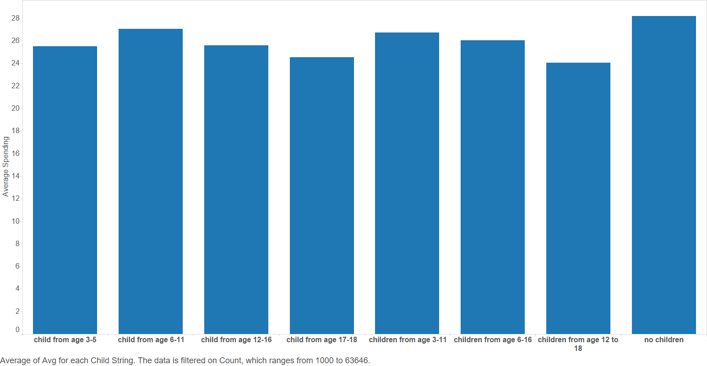
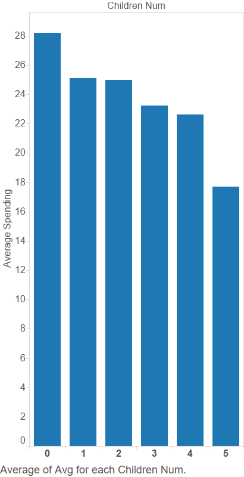
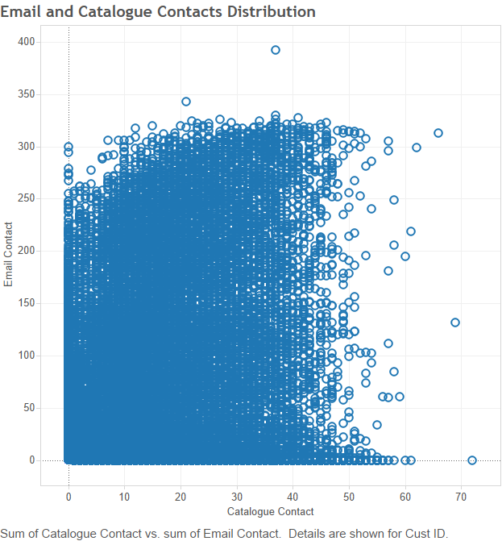

# Introduction

## Project overview

For this project sales and marketing data from a multi-channel company were provided. The data cover the company's retail stores, catalogue and website and detail customer records, marketing contacts, orders, and line item records.

This project used these data to investigate various marketing techniques used by this company in order to understand their effectiveness. A specific focus was placed upon email vs. catalogue marketing. 

## This document

This document is split in to three distinct sections, A, B and C. Section A covers our exploratory data analyses as we seek to profile the data and understand both its sales and its marketing activity. In section B we apply traditional Recency Frequency Monetary ("RFM") segmentation to the data. Section C extends section B based on the results found in section A, adding a further dimension to the RFM model.

The `SQL` and `R` code used to perform these analyses has been provided as supplementary files, and sections of the `R` code can be viewed in this report using the _Code_ buttons to toggle code viewing.

This document has interactive elements and is best viewed using a modern web browser such as Mozilla Firefox or Google Chrome.

```{r prep, echo = TRUE, message=FALSE}
# Load packages
library(dplyr)
library(RPostgreSQL)
library(tidyr)
library(ggplot2)
library(igraph)
library(networkD3)
library(knitr)
library(broom)
library(readr)

# Set up connection to the Postgres database
db <- src_postgres(dbname = "dm")

# Set up theme object for prettier plots
theme_jim <-  theme(legend.position = "bottom",
    axis.text.y = element_text(size = 16, colour = "black"),
    axis.text.x = element_text(size = 16, colour = "black"),
    legend.text = element_text(size = 16),
    legend.title = element_text(size = 16),
    title = element_text(size = 16),
    strip.text = element_text(size = 16, colour = "black"),
    strip.background = element_rect(fill = "white"),
    panel.grid.minor.x = element_blank(),
    panel.grid.major.x = element_line(colour = "grey", linetype = "dotted"),
    panel.grid.minor.y = element_line(colour = "lightgrey", linetype = "dotted"),
    panel.grid.major.y = element_line(colour = "grey", linetype = "dotted"),
    panel.margin.y = unit(0.1, units = "in"),
    panel.background = element_rect(fill = "white", colour = "lightgrey"),
    panel.border = element_rect(colour = "black", fill = NA))

# Source the data from the database
lines <- tbl(db, "lines_clean")
orders <- tbl(db, "orders_clean")
contacts <- tbl(db, "contacts_clean")
sum_tabl <- tbl(db, "summary_table")

# Function that takes a string and converts it in to "proper case" (i.e.
# the first letter is capitalised, all remaining letters are lower case)
# N.b. for multi-word strings, only the first word will be affected
toproper <- function(x) { 
  first <- substring(x, 1, 1) %>% toupper()
  rest <- substring(x, 2) %>% tolower()
  whole <- paste0(first, rest)
  return(whole)
}

# Set lm tidy coef names
tidy_names <- c("Term", "Estimate", "Std. Error", "t-Stat.", "p-Value")
```

# Section A - Exploratory Analysis

## Section A1 - Response rates

```{r response_rates, message = FALSE, eval = FALSE}
#Create a table called 'rates' to capture response rates over time.
rates <- data.frame(season = c('07Fall',
                               '07Spr',
                               '06Fall',
                               '06Spr',
                               '05Fall',
                               '05Spr',
                               '04Fall',
                               '04Spr'))

# Set up specific start and end dates for the seasons
rates <- cbind(rates, startDate = as.Date(c('2007-07-01', 
                                            '2007-01-01',
                                            '2006-07-01',
                                            '2006-01-01',
                                            '2005-07-01',
                                            '2005-01-01',
                                            '2004-07-01',
                                            '2004-01-01'),
                                          format="%Y-%m-%d"))

rates <- cbind(rates, endDate = as.Date(c('2007-12-31',
                                          '2007-06-30',
                                          '2006-12-31',
                                          '2006-06-30',
                                          '2005-12-31',
                                          '2005-06-30',
                                          '2004-12-31',
                                          '2004-06-30'),
                                        format="%Y-%m-%d"))

# Set up empty fields to hold results later
rates$numberEmailed <- NA
rates$numberResponded <- NA
rates$E_responseRate <- NA
rates$numberCatalogued <- NA
rates$numberCatResponded <- NA
rates$C_responseRate <- NA

# Fill in 'numberEmailed' column, the number of people who were emailed during that season.
# And Fill in 'numberResponded' column, the number of people 
# who were emailed and bought things in that seasond
for(i in 1:nrow(rates)) {
    
srtdate <- rates$startDate[i]
enddate <- rates$endDate[i]

#get Cust_ids who were emailed within each season from contacts table.
aa <- filter(contacts, 
             ContactDate %in% seq(srtdate,enddate, "day"), 
             ContactType=="E")

#since many of those ids are repeated, I only want the unique ones.
ids_emailed <- select(aa, Cust_ID) %>% unique() 

# From that subset of unique ids who bought during each season?
bb <- filter(orders,
             Cust_ID %in% ids_emailed[,1], 
             OrderDate %in% seq(srtdate,enddate, "day"))

# Insert results into columns.
rates$numberEmailed[i] <-ids_emailed %>% count()
rates$numberResponded[i] <- select(bb, Cust_ID) %>% 
                            unique() %>% 
                            count()
}

rates$numberEmailed <- as.numeric(rates$numberEmailed)
rates$numberResponded <- as.numeric(rates$numberResponded)
rates$E_responseRate <- round((rates$numberResponded/rates$numberEmailed)*100,
                              2)


#Same method as above, but now for Catalogues:
for(i in 1:nrow(rates)) {
    
srtdate <- rates$startDate[i]
enddate <- rates$endDate[i]

aa <- filter(contacts, 
             ContactDate %in% seq(srtdate, enddate, "day"), 
             ContactType=="C")

ids_Catalogued < -select(aa, Cust_ID) %>% unique() 

bb <- filter(orders,
             Cust_ID %in% ids_Catalogued[,1], 
             OrderDate %in% seq(srtdate,enddate, "day"))

rates$numberCatalogued[i] <-ids_Catalogued %>% count()
rates$numberCatResponded[i] <- select(bb,Cust_ID) %>% 
                                unique() %>% 
                                count()
}

rates$numberCatalogued <- as.numeric(rates$numberCatalogued)
rates$numberCatResponded <- as.numeric(rates$numberCatResponded)
rates$C_responseRate <-round((rates$numberCatResponded/rates$numberCatalogued)*100,
                             2)
```

```{r get_rates, include = FALSE}
rates <- readr::read_csv("./jon/rates.csv")
```

Response rates were calculated for customers emailed and sent catalogues. This was done at a season level, looking at Spring vs. Autumn ("Fall") response rates across the data. The results are presented in the table below.

```{r show_rates}
rates %>% 
    select(season, startDate, endDate, responseRate, C_responseRate) %>% 
    arrange(startDate) %>% 
    na.omit() %>% 
    kable(col.names = c("Season", "Start", "End", "Email Response Rate",
                        "Catalogue Response Rate"),
          caption = "Table 1: Seasonal Response Rates")
```

We visualised these results and present them in figures one and two below.

```{r show_email, out.width = 600, out.height= 600, fig.retina = NULL, fig.align='center', fig.cap="Figure 1: Email Marketing Customer Response Rates By Season"}
include_graphics("./jon/Email Marketing Customer Response Rates By Season.jpg")
```

Figure one shows the email marketing response rates for customers who were sent at least one marketing email in the season (lasting 6 months). They are counted as having responded if they have bought at least 1 item from the shop in that season through any channel (on-line order, in shop, or by phone).

The blue bars show that the company have increased the number of email addresses on their subscription list. The orange line peaking every Fall likely occurs due to the natural increase in sales that take place in December (as noted in the data description). However, this seasonal spike might also be due to customer’s increased responsiveness to marketing, as customers are already shopping heavily in that period and will respond to marketing more readily.

```{r show_cat, out.width = 600, out.height= 600, fig.retina = NULL, fig.align='center', fig.cap="Figure 2: Catalogue Marketing Customer Response Rates By Season"}
include_graphics("./jon/Catalogue Marketing Customer Response Rates By Season.jpg")
```

Figure two shows the catalogue marketing response rates for customers who were sent at least one catalogue in the season. They are counted as having responded if they have bought at least 1 item from the shop in that season through any channel.

The company sends out broadly consistent numbers of catalogues each spring. They also send more each Fall period. Catalogue response rates show a decreasing trend across the Fall periods. This is perhaps because a consistent consumer base who respond to catalogue marketing have been saturated in the number of catalogues being sent out, leading to a fall in the response rate. Or perhaps catalogue marketing is becoming less effective compared to other forms, such as digital. 

## Section A2 - Order method and sales

We also looked at sales split down by the different order methods in order to understand the customers' purchasing habits. There are four types of order in the data: internet (I), store (ST), phone (P), and mail (m). Summarising total orders (by items and spend) for these order types generates the summary table below.

```{r order_type_summary}
order_type_summary <- lines %>% 
    group_by(ordernum) %>% 
    summarise(items = n(),
              spend = sum(line_dollars)) %>% 
    inner_join(orders, by = c("ordernum" = "ordernum")) %>% 
    group_by(order_method) %>% 
    summarise(items_purchased = sum(items),
              total_spend = sum(spend)) %>% 
    collect() %>% 
    mutate(order_method = gsub("M", "Mail", order_method),
           order_method = gsub("I", "Internet", order_method),
           order_method = gsub("P", "Phone", order_method),
           order_method = gsub("ST", "Store", order_method))

order_type_summary %>% 
    kable(col.names = c("Order method", "Items purchased", "Total spend (£)"),
          format.args = list(big.mark = ','),
          digits = 0,
          caption = "Table 2: Order method summary")
```

Whilst store-based sales dominated in terms of items purchased, both phone and internet sales show strong figures for total spend, perhaps indicating an increased consumer preference to make larger orders via those media.

```{r order_type_regression}
method_fit <- lines %>% 
    group_by(ordernum) %>% 
    summarise(items = n(),
              spend = sum(line_dollars)) %>% 
    inner_join(orders, by = c("ordernum" = "ordernum")) %>% 
    collect() %>% 
    mutate(order_method = gsub("M", "Mail", order_method),
           order_method = gsub("I", "Internet", order_method),
           order_method = gsub("P", "Phone", order_method),
           order_method = gsub("ST", "Store", order_method),
           order_method = as.factor(order_method)) %>% 
    lm(spend ~ order_method, data = .)

method_tidy <- tidy(method_fit)
method_glance <- glance(method_fit)
```

In order to understand the statistical effect that order method has on spend, we performed a simple regression of order spend (£) on order method. The results of this regression are presented in the tables below.

```{r show_fit}
kable(method_tidy, 
      col.names = tidy_names,
      digits = 3,
      caption = "Table 3: Order method vs. sales regression coefficients")
```

```{r show_fit_stats}
method_glance %>% select(2, 3, 4, 5, 6, 8) %>% 
kable(col.names = c("Adjusted R-Squared", "Sigma",
                                   "F-Stat.", "p-Value", "Deg. Freedom",
                                   "AIC"),
      digits = 3,
      caption = "Table 4: Order method vs. sales regression summary")
```

As can be seen from the results of the regression, mail and phone orders are likely to increase the order spend relative to internet-based orders, whilst store orders are likely to be less valuable. These results are statistically significant. However, the overall model fit is exceptionally poor (R^2^ of just `r round(summary(method_fit)$r.squared, 3)`). This leads us to conclude that order type is not particularly useful in explaining order spend. Therefore a customer's order type preference should probably not inform our choice of how to market to customers.

## Section A3 - Store distance and sales

```{r generate_siang_data, eval = FALSE}
#Remove line with no distance data
new_summary <- summary %>% filter(!is.na(StoreDist))

#Calculate subtotal of dollar spent
line_gift <- lines %>% filter(Gift == "Y")
line_nogift <- lines %>% filter(Gift == "N")
line_retail <- lines %>% filter(is.na(Gift))
sum_gift <- line_gift %>% group_by(Cust_ID) %>% summarise(sum_dollar_gift = sum(LineDollars, na.rm = TRUE))
sum_nogift <- line_nogift %>% group_by(Cust_ID) %>% summarise(sum_dollar_nongift = sum(LineDollars, na.rm = TRUE))
sum_retail <- line_retail %>% group_by(Cust_ID) %>% summarise(sum_dollar_retail = sum(LineDollars, na.rm = TRUE))

#Aggregate data on ID level
totalspendbyID <- lines %>% group_by(Cust_ID) %>% summarise(sum_dollar_total = sum(LineDollars, na.rm = TRUE))
storedistancebyID <- new_summary %>% select(Cust_ID,StoreDist)
ordermethodbyID <- read_csv("./Siang/data/order_method.csv",col_names = TRUE,col_types = NULL,skip=0)
paymentmethodbyID <- read_csv("payment_method.csv",col_names = TRUE,col_types = NULL,skip=0)

#Join datasets by ID
data<- left_join(totalspendbyID,sum_gift,by = "Cust_ID")
data<- left_join(data,sum_nogift,by = "Cust_ID")
data<- left_join(data,sum_retail,by = "Cust_ID")
data<- left_join(data,storedistancebyID,by = "Cust_ID")
data<- left_join(data,ordermethodbyID,by = "Cust_ID")
data<- left_join(data,paymentmethodbyID,by = "Cust_ID")
```

```{r get_siang_data, include = FALSE}
data <- readr::read_csv("./Siang/resources/data.csv",
                 col_names = TRUE,
                 col_types = NULL,
                 skip=0)
attach(data)
```

In this section we examined if a customers' store distance affected their spending and their order methods. Figure three shows the average distance from the customer’s address to the nearest company store and the results were broken down by the type of their order methods. Comparing to the channels of internet, mail and phone, customers who purchase products via retail channel (store) generally have an address that is nearest to the store. Customers who purchase through mail via catalogue channel have the highest average store distance. Overall, customers who do not purchase directly at the retail store live relatively far away from their nearest company store.

```{r show_siang_order_method_plot, echo=FALSE, out.width = 200, out.height= 200, fig.retina = NULL, fig.align='center', fig.cap="Figure 3: Average Store Distance (miles)"}
knitr::include_graphics("./Siang/resources/ordermethod.png")
```

## {.tabset .tabset-fade}

The total spend of each customer was calculated to investigate the relationship between store distance and the total amount of money they spent on the products. Extending the work performed in section A2, the amount of money spent was split into different order channels: retail store, internet, mail and phone. Phone and mail are the two methods by which catalogue channel orders are placed. Linear regression and scatter plots were employed to investigate the relationship and identify potential trends.

Results for all four scenarios are similar. Although the p-values of store distance in all four models are very significant, the R-squared and estimate are zero or near-zero. That implies the independent variable - store distance might be statistically significant but it is not economically significant at all, which was also supported by the scatter plots where no trend is observed.

### Internet

```{r internet_mod}
model211 <- lm(sum_dollar_internet ~ StoreDist)
```

```{r internet_graph, out.width = 300, out.height= 300, fig.retina = NULL, fig.align='center', fig.cap="Figure 4: Sum of spending via internet"}
include_graphics("./Siang/resources/s_internet.png")
```

```{r show_internet_model}
kable(tidy(model211), col.names = tidy_names, caption = "Table 5: Coefficients", digits = 4)
kable(glance(model211), col.names = toproper(glance(model211) %>% names()), caption = "Table 6: Regression Statistics", digits = 4)
```

### Retail store

```{r store_model}
model212 <- lm(sum_dollar_retail ~ StoreDist)
```

```{r store_graph, out.width = 300, out.height= 300, fig.retina = NULL, fig.align='center', fig.cap="Figure 5: Sum of spending via retail store"}
include_graphics("./Siang/resources/s_store.png")
```

```{r show_store_model}
kable(tidy(model212), col.names = tidy_names,caption = "Table 7: Coefficients", digits = 4)
kable(glance(model212), col.names = toproper(glance(model212) %>% names()), caption = "Table 8: Regression Statistics", digits = 4)
```

### Mail

```{r mail_model}
model213 <- lm(sum_dollar_mail~StoreDist)
```

```{r mail_graph, out.width = 300, out.height= 300, fig.retina = NULL, fig.align='center', fig.cap="Figure 6: Sum of spending via catalog (Mail)"}
include_graphics("./Siang/resources/s_mail.png")
```

```{r show_mail_model}
kable(tidy(model213), col.names = tidy_names, caption = "Table 9: Coefficients",digits = 4)
kable(glance(model213), col.names = toproper(glance(model213) %>% names()),caption = "Table 10: Regression Statistics", digits = 4)
```

### Phone

```{r phone_model}
model214 <- lm(sum_dollar_phone~StoreDist)
```

```{r phone_graph, out.width = 300, out.height= 300, fig.retina = NULL, fig.align='center', fig.cap="Figure 7: Sum of spending via catalog (Phone)"}
include_graphics("./Siang/resources/s_phone.png")
```

```{r show_phone_model}
kable(tidy(model214), col.names = tidy_names,caption = "Table 1: Coefficients", digits = 4)
kable(glance(model214), col.names = toproper(glance(model214) %>% names()),caption = "Table 12: Regression Statistics", digits = 4)
```

## {.tabset .tabset-fade}

A new attempt to investigate the relationship between customer spending and store distance was made, the variable of dollar spent was replaced with frequency of purchase made by customers. The identical methodology and data segmentation was used for the following analysis, using linear regression and scatter plots to investigate the relationship and identify potential trends.

Similar to the results from part 1, the variable store distance is not economically significant in all four scenarios. Term estimates and R^2^ values are very low in each case. Therefore, it can be concluded that there is no direct relationship between store distance and frequency of customer shopping, that is, customers do not shop more frequently based on the store distance.

### Internet

```{r internet_freq_mod}
model224 <- lm(frequency_internet~StoreDist)
```

```{r out.width = 300, out.height= 300, fig.retina = NULL, fig.align='center', fig.cap="Figure 8: Frequency of purchase via internet"}
include_graphics("./Siang/resources/f_internet.png")
```

```{r, echo=FALSE}
kable(tidy(model224), col.names = tidy_names, caption = "Table 13: Coefficients", digits = 4)
kable(glance(model224), col.names = toproper(glance(model224) %>% names()),caption = "Table 14: Regression Statistics", digits = 4)
```

### Retail store

```{r ret_freq_mod}
model221 <- lm(frequency_store~StoreDist)
```

```{r out.width = 300, out.height= 300, fig.retina = NULL, fig.align='center', fig.cap="Figure 9: Frequency of purchase via retail store"}
include_graphics("./Siang/resources/f_store.png")
```

```{r}
kable(tidy(model221), col.names = tidy_names,caption = "Table 15: Coefficients", digits = 4)
kable(glance(model221), col.names = toproper(glance(model221) %>% names()), caption = "Table 16: Regression Statistics", digits = 4)
```

### Mail

```{r}
model223 <- lm(frequency_mail~StoreDist)
```

```{r, echo=FALSE, out.width = 300, out.height= 300, fig.retina = NULL, fig.align='center', fig.cap="Figure 10: Frequency of purchase via mail"}
include_graphics("./Siang/resources/f_mail.png")
```

```{r}
kable(tidy(model223), col.names = tidy_names, caption = "Table 17: Coefficients", digits = 4)
kable(glance(model223), col.names = toproper(glance(model223) %>% names()), caption = "Table 18: Regression Statistics", digits = 4)
```

### Phone

```{r}
model222 <- lm(frequency_phone~StoreDist)
```

```{r out.width = 300, out.height= 300, fig.retina = NULL, fig.align='center', fig.cap="Figure 11: Frequency of purchase via phone"}
include_graphics("./Siang/resources/f_phone.png")
```

```{r}
kable(tidy(model222), col.names = tidy_names, caption = "Table 19: Coefficients",digits = 4)
kable(glance(model222), col.names = toproper(glance(model222) %>% names()), caption = "Table 20: Regression Statistics",digits = 4)
```

##

Given the results we found during this section, we do not believe that store distance will be a valuable dimension to segment customers by for marketing purposes. 


## Section A4 - Gift giving network

Noting that the data contained information on customers buying each other gifts, we explored the network structure of the gift-giving network to understand if it could be used to help the company's marketing efforts.

We summarised the data, calculating the number of gifts sent by each customer to their gift recipients to create an edgelist graph structure.

```{r create_edgelist}
graph_data <- lines %>%
              select(cust_id, ordernum, recipnum) %>% 
              filter(recipnum != '' &
                     cust_id != recipnum) %>% 
              group_by(cust_id, recipnum) %>% 
              summarise(weight = n()) %>% 
              collect()
```

We then converted this to a graph object in `R` using the `igraph` package and computed the out-degree centrality for each node (i.e. customer) in the graph. The out-degree centrality for each customer was the number of gifts they had sent to other customers.

```{r get_out_deg}
# Make the graph
graph <- graph_from_data_frame(graph_data)

# Extract out-degree of gift-giving
outdeg <- degree(graph, mode = "out") %>% 
            data.frame() %>% 
            add_rownames("cust_id") %>% 
            dplyr::as_data_frame() %>% 
            rename_(out_deg = '.')

# Clean up graph object
rm(graph)

# Ensure we have out-degree for all customers
outdeg <- sum_tabl %>% 
    select(cust_id) %>% 
    collect() %>% 
    left_join(outdeg, by = c("cust_id" = "cust_id")) %>% 
    mutate(out_deg = ifelse(is.na(out_deg), 0, out_deg),
           od = ntile((out_deg), 5))
```

In the figure below, we present an example of the resulting graph structure. (Note that due to the size of the graph, not all nodes are shown). There is a clear structure to this graph. The majority of nodes are not connected, with most customers sending/receiving gifts to/from a very small number of other customers. Groups are small, with little connection between groups of customers, there are very few chains or cycles in the graph. There are, however, some users who have sent a huge number of gifts and therefore stand out in the network representation. (Note that the visualisation is interactive - click and drag/mousewheel zoom to navigate the network, and select/drag/highlight individual node with the mouse).

```{r show_graph, message = FALSE, fig.align='center'}
# Subset the data slightly
to_plot <- graph_data %>% filter(weight >= 7) %>% 
            bind_rows(graph_data %>% filter(cust_id == "33784549")) %>% 
            distinct()

# Make the graph object
graph <- graph_from_data_frame(to_plot)

# Set up networkD3 graph data, setting all nodes to be in same group/cluster
nw <- igraph_to_networkD3(graph, group = rep(1, V(graph) %>% length()))

# Weight links by number of gifts sent
nw$links$value <- E(graph)$weight

# Plot the network
net <- forceNetwork(Links = nw$links,
             Nodes = nw$nodes,
             colourScale = JS("d3.scale.category20()"),
             Source = "source",
             Target = "target",
             Value = "value",
             NodeID = "name",
             Group = "group",
             charge = -250,
             linkColour = "grey",
             opacity = 1,
             legend = F,
             bounded = F,
             zoom = TRUE)
net
```

Having viewed the graph structure, we then examined the relationship between the out-degree centrality of a customer, and their total purchases and total spend. This relationship is shown in figure 12 where a clear positive relationship between gift recipients and total spend is observed. 

```{r gift_spend_plot, fig.cap = "Figure 12: Relationship between gifts sent and total spend. Red line shows linear fit of the data.", out.width=600, out.height=600, fig.retina = NULL, fig.align='center', message = FALSE}
purchase_stats <- orders %>% 
    group_by(cust_id) %>% 
    summarise(orders = n()) %>% 
    left_join(lines %>% group_by(cust_id) %>% summarise(spend = sum(line_dollars)),
              by = c("cust_id" = "cust_id")) %>% 
    collect()

purchase_stats <- outdeg %>% 
    left_join(purchase_stats, by = c("cust_id" = "cust_id"))

gift_spend_rel <- purchase_stats %>% 
    ggplot(aes(x = out_deg, y = spend)) +
    geom_point(aes(size = orders), colour = "steelblue", alpha = 0.5) +
    scale_y_continuous(labels = scales::comma) +
    xlab("Gift recipients (out-degree centrality)") +
    ylab("Total spend (£)") +
    guides(size = guide_legend(title = "Total orders")) +
    geom_smooth(alpha = 0.75, colour = "firebrick", method = "lm") +
    theme_jim

gift_spend_rel
```

This relationship was further quantified using a simple linear model, regressing total spend on out-degree centrality and controlling for the total number of orders. The results of this regression are presented below.

```{r regress_outdeg}
fit <- lm(spend ~ out_deg + orders, data = purchase_stats)
tidy_fit <- tidy(fit)
glance_fit <- glance(fit)

kable(tidy_fit, col.names = tidy_names, digits = 3, caption = "Table 21: Spend vs. gift giving regression coefficients.")
glance_fit %>% 
    select(2, 3, 4, 5, 6, 8) %>% 
    kable(col.names = c("Adj. R-Squared", "Sigma", "F-stat.", "p-Value", 
                        "Deg. Freedom", "AIC"),
          digits = 3,
          caption = "Table 22: Spend vs. gift giving regression summary.")
```

From this model, it is clear that out-degree centrality does have a statistically and economically significant effect on total spend, when controlling for number of orders. The estimates are large and statistically significant, and the overall model has a good fit, explaining around 60% of the variation in the data. Therefore we have considered out-degree centrality to be a plausible dimension to segment customers on for marketing purposes, as explored in section C. 

## Section A5 - The effect of children

We also investigated the effect of children (of various ages) on customer spending. 

```{r get_kane_1, include = FALSE}
load("./Kane/First.RData")
```

We have addressed the question of whether there is a correlation between the number of children in a household, and the children's age, with customer spending. To do this we used the `Y`/`N` variable on whether the customer has a child between certain ages, namely between the age of 0 to 2, 6 to 11, 12 to 16 and 17 to 18.

```{r get_kane, eval = FALSE}
drv <- dbDriver("PostgreSQL")

con <- dbConnect(drv, dbname="dm",host="localhost",port=5432,user="postgres",password="gy!be1989")
df <- dbGetQuery(con,
                          "SELECT avg(line_dollars),COUNT(DISTINCT summary.cust_id), 
                          Child0_2, Child3_5, Child6_11, Child12_16, Child17_18 
                          from summary inner join lines on summary.cust_id = lines.cust_id
                          where Child0_2 IS NOT NULL group by Child0_2, Child3_5, Child6_11, Child12_16, Child17_18
                          order by avg desc")

df$child0_2 <- ifelse(df$child0_2=="Y", 1, 0)
df$child3_5 <- ifelse(df$child3_5=="Y", 1, 0)
df$child6_11 <- ifelse(df$child6_11=="Y", 1, 0)
df$child12_16 <- ifelse(df$child12_16=="Y", 1, 0)
df$child17_18 <- ifelse(df$child17_18=="Y", 1, 0)
```

In order to make these dummy variables more useful, we combined them in to a single categorical variable. We note a weakness of the data in that a family could have numerous children in a certain age range but the data will only consider it to be one child. 

``` {r calculate_children}
calculateChildrenNum <- function(Child0_2, Child3_5, Child6_11, Child12_16, Child17_18){
  x = 0
  if (Child0_2 == 1){
  x = x + 1
  }
  if (Child3_5 == 1){
    x = x + 1
  }
  if (Child6_11 == 1){
    x = x + 1
  }
  if (Child12_16 == 1){
    x = x + 1
  }
  if (Child17_18 == 1){
    x = x + 1
  }
   x
}

createChildrenString <- function(Child0_2, Child3_5, Child6_11, Child12_16, Child17_18){
  x = "child"
  if (Child0_2 == 1){
    x = paste(x, "0_2,")
  }
  if (Child3_5 == 1){
    x = paste(x, "3_5,")
  }
  if (Child6_11 == 1){
    x = paste(x, "6_11,")
  }
  if (Child12_16 == 1){
    x = paste(x, "12_16,")
  }
  if (Child17_18 == 1){
    x = paste(x, "17_18")
  }
  x
}

df$childrenNum = apply(df[,c('child0_2', 'child3_5', 'child6_11', 'child12_16', 'child17_18')], 1, function(x) calculateChildrenNum(x[1],x[2],x[3],x[4],x[5]))
df$childString = apply(df[,c('child0_2', 'child3_5', 'child6_11', 'child12_16', 'child17_18')], 1, function(x) createChildrenString(x[1],x[2],x[3],x[4],x[5]))

```

We then visualised the relationship between customers having children and their average spending. Figure 13 shows that customers with no children have the highest spending on average. It also seems that if a family has a child around the age of 6-11, the spending will be more.

```{r show_kane_vis_1, fig.cap = "Figure 13: Average spend by age range of children in customer family.", fig.align="center"}

```

Figure 14 takes into account how _many_ children a household has based on the dummy variables in the data. Here the trend shows that the less children a customer has the more they are likely to spend. This seems reasonable in the context of the data as a family probably have less money to spend on gifts if they have more children. 

```{r show_kane_vis_2, fig.cap = "Figure 14: Average spend by number of children",fig.align="center"}

```

We quantified the trends observed in figures 13 and 14 using regressions.

We first regressed the child categorical variable against the amount spent. The intercepts represents a customer with no children and the other categories represent the age of the children.

```{r show_kane_2, eval = FALSE}
df <- dbGetQuery(con,
                 "SELECT line_dollars, Child0_2, Child3_5, Child6_11, Child12_16, Child17_18 
                          from summary inner join lines on summary.cust_id = lines.cust_id
                          where Child0_2 IS NOT NULL")
```

```{r get_kane_2, include = FALSE}
load("./Kane/Second.RData")
```

```{r kane_model_1}
df$child0_2 <- ifelse(df$child0_2=="Y", 1, 0)
df$child3_5 <- ifelse(df$child3_5=="Y", 1, 0)
df$child6_11 <- ifelse(df$child6_11=="Y", 1, 0)
df$child12_16 <- ifelse(df$child12_16=="Y", 1, 0)
df$child17_18 <- ifelse(df$child17_18=="Y", 1, 0)

model <- lm(df$line_dollars ~ df$child0_2 + df$child3_5 + df$child6_11 + df$child12_16 + df$child17_18 )

kable(tidy(model), caption = "Table 23: Regression Coefficients", digits = 3, col.names = tidy_names)
kable(glance(model), caption = "Table 24: Regression Statistics", digits = 3, col.names = toproper(glance(model) %>% names()))
```

Whilst the coefficients of the model are typically significant, the R^2^ value is low.  Even though the coefficients reveal the presence of a trend, such a low R^2^ indicates that having children is only a small factor in determining how much a customer will spend. 

We therefore created a second model, which examined the effect the _number_ of children had on spending.

```{r kane_model_2}
df$childrenNum <- apply(df[,c('child0_2', 'child3_5', 'child6_11', 'child12_16', 'child17_18')], 1, function(x) calculateChildrenNum(x[1],x[2],x[3],x[4],x[5]))

df$childrenFactor <- factor(df$childrenNum)

model2 <- lm(df$line_dollars ~ df$childrenFactor)

kable(tidy(model2), caption = "Table 25: Coefficients", digits = 3, col_names = tidy_names)
kable(glance(model2), caption = "Table 26: Regression Statistics", digits =3, col.names = toproper(glance(model2) %>% names()))
```

Again the R^2^ is really low. However there is a trend that as a customer has more children they spend less. Again this might be because a family probably have less money to spend on gifts if they have to take care of their children. 

Despite this, however, the poor fit of the model likely means that the presence and/or age of children in a customers' household will be a poor dimension for segmentation in a marketing scenario.

## Section A6 - Communication levels

We observed that emails were sent intensively during 2007 with a maximum of 48 emails sent to a single customer.

We therefore decided to investigate whether the number of emails/catalogues sent to a customers was correlated with how much they would purchase.

Figure 13 shows the distribution of number of emails and catalogues sent between 2004 and 2007. Each point represents a customer.

```{r kin_email_dist, fig.cap = "Figure 15: Distribution of number of emails and catalogues sent to customers", fig.align="center"}

```

```{r kin_get_data, include = FALSE}
load("./Kin/digital marketing.RData")
```

We performed a linear regression of sales (dollar spend) on the number of emails and catalogues received.

```{r kin_regression}
tidy(lm(purchase~mailcount+ctlgcount,data=CandL_R)) %>% 
    kable(col.names = c("Term", "Estimate", "Std. Error", 
                        "t-Stat.", "p-Value"),
          digits = 3,
          caption = "Table 27: Sales vs. contact count regression coefficients.")

glance(lm(purchase~mailcount+ctlgcount,data=CandL_R)) %>% 
    select(2, 3, 4, 5, 6, 8) %>% 
    kable(col.names = c("Adj. R-Squared", "Sigma", 
                        "F-stat.", "p-Value", "Deg. Freedom", 
                        "AIC"),
          digits = 3,
          caption = "Table 28: sales vs. contact count regression summary.")
```

We see that both number of emails sent and the number of catalogues sent have positive effect on the amount spent by customers. However, the number of emails sent is economically insignificant when compared with the effect of catalogues sent. 

Also, the adjusted R^2^ of the model is very small, indicating that it cannot explain the variation in spending. Considering that people might have different response in different season, further analysis was performed for each month. However, the results were still insignificant, suggesting that sending out contacts more frequently is unlikely to boost sales.

# Section B - RFM Segmentation

## Generating RFM segments

In order to create and test a marketing approach for this data, we first separated email from catalogue marketing communications. We then further split the data based on the date. The contacts data set contained data from 2005 up to 2007. As such we took the first half of data (i.e. up to 2006-06-30) as one sample, leaving a validation set covering dates 2006-07-01 to 2008-01-01.

```{r split_data, eval = FALSE}
/* Clean up tables as needed *********/
drop table if exists email_first_half, email_second_half, cat_first_half, cat_second_half;
select *
into email_first_half
from
	contacts_clean
where contact_type = 'E'
and contact_date <= '2006-06-30';

/*
select * from email_first_half
*/

select *
into email_second_half
from
	contacts_clean
where contact_type = 'E'
and contact_date > '2006-06-30';
/*
select * from email_second_half
*/


select *
into cat_first_half
from
	contacts_clean
where contact_type = 'C'
and contact_date <= '2006-06-30';
/*
select * from cat_first_half
*/

select *
into cat_second_half
from
	contacts_clean
where contact_type = 'C'
and contact_date > '2006-06-30';
/*
select * from cat_second_half
*/
```

This generated four data sets. One covering email contacts in the first half of the period for which data were available, one covering email contacts in the second half of the period; one covering catalogue contacts in the first of the period, and one covering catalogue contacts in the second half of the period.

We then calculated the RFM segment for each customer in each of these four data sets. Recency was calculated using the order that was closest to the end of the period for each data set (2006-06-30 for the first half of the data, and 2008-01-01 for the second period). Frequency was estimated via a simple count of orders that were made in the period. Monetary was the average order spend ($) for each customer in the period.

```{r rfm}
# Define function to pull through specific customers from the db based on table
get_custs <- function(table_name) {
    tbl(db, table_name) %>% select(cust_id) %>% distinct()
}    

# Define function to, given a set of customers, return the rfm segments for them
cust_rfm <- function(customers, start, stop) {
    # Compute r
    r <- lines %>%
        filter(order_date >= start) %>% 
        filter(order_date <= stop) %>% 
        inner_join(customers, by = c("cust_id" = "cust_id")) %>% 
        group_by(cust_id) %>% 
        summarise(most_recent = max(order_date)) %>% 
        collect() %>% 
        mutate(age = difftime(stop, most_recent, units = "days"),
               age = as.numeric(age),
               age = ifelse(age < 0, Inf, age),
               r = ntile(desc(age), 5))
    
    # Compute f
    f <- lines %>% 
        filter(order_date >= start) %>% 
        filter(order_date <= stop) %>% 
        inner_join(customers, by = c("cust_id" = "cust_id")) %>% 
        group_by(cust_id) %>% 
        summarise(purchases = n()) %>% 
        collect() %>% 
        mutate(f = ntile((purchases), 5))
    
    # Compute m
    m <- lines %>% 
        filter(order_date >= start) %>% 
        filter(order_date <= stop) %>% 
        inner_join(customers, by = c("cust_id" = "cust_id")) %>% 
        group_by(cust_id, ordernum) %>% 
        summarise(spend = sum(line_dollars)) %>% 
        group_by(cust_id) %>% 
        summarise(avg_spend = mean(spend)) %>% 
        collect() %>% 
        mutate(m = ntile((avg_spend), 5))
    
    # Combine and return
    rfm <- r %>% 
        left_join(f, by = c("cust_id" = "cust_id")) %>% 
        left_join(m, by = c("cust_id" = "cust_id")) %>% 
        select(cust_id, r, f, m) %>% 
        rowwise() %>% 
        mutate(rfm = paste(r, f, m, sep = ""))
    
    return(rfm)   
}    


# Emailed customers
email_1_rfm <- get_custs("email_first_half") %>% cust_rfm(start = "2005-01-01", stop = "2006-07-01")
email_2_rfm <- get_custs("email_second_half") %>% cust_rfm(start = "2006-07-01", stop = "2008-01-01")

# Catalogue customers
cat_1_rfm <- get_custs("cat_first_half") %>% cust_rfm(start = "2005-01-01", stop = "2006-07-01")
cat_2_rfm <- get_custs("cat_second_half") %>% cust_rfm(start = "2006-07-01", stop = "2008-01-01")
```

For each contact type and customer, we calculated the total number of contacts received by each customer in the period.

```{r get_contacts}
# Function to get the contacts per customer in the sample
get_contacts <- function(table_name) {
    tbl(db, table_name) %>% 
        select(cust_id, contact_date) %>% 
        group_by(cust_id) %>% 
        summarise(contacts = n())
}

# Email contacts
email_1_contacts <- get_contacts("email_first_half")
email_2_contacts <- get_contacts("email_second_half")

# Catalogue contacts
cat_1_contacts <- get_contacts("cat_first_half")
cat_2_contacts <- get_contacts("cat_second_half")

rm(get_contacts)
```

We then found all purchases that could be attributed to a contact for each contact type, customer, and period. For emails, we attributed all purchases made within 30 days of receipt of an email to that contact, reasoning that any later purchases were probably not due to that contact. For catalogues, we extended the attribution window and attributed all purchases made within 100 days of receipt of the catalogue to that contact. 

```{r attributable_sales}
# Function to join segmented contacts table together and find attributable sales
attributable_sales <- function(table_name, interval) {
sql_cmd <- paste0("order_date between contact_date and (contact_date + interval '", interval, " days')")  

tbl(db, table_name) %>% 
    left_join(orders, by = c("cust_id" = "cust_id")) %>% 
    select(cust_id, contact_date, ordernum, order_date) %>% 
    filter_("order_date" >= "contact_date") %>% 
    filter(sql(sql_cmd))
}    

# Emailed customers - only within 30 days
email_1_att <- attributable_sales("email_first_half", 30)
email_2_att <- attributable_sales("email_second_half", 30)

# Catalogue customers - only within 100 days
cat_1_att <- attributable_sales("cat_first_half", 100)
cat_2_att <- attributable_sales("cat_second_half", 100)

rm(attributable_sales)
```

We calculated the total number of attributable orders placed by each customer in the period, and joined this information, along with the number of contacts to the RFM segment data calculated earlier. Summarising this data to calculate _total_ contacts and _total_ sales per RFM segment enabled us to calculated the _response rate_ \eqref{eq:resp} for each segment.

\begin{equation} \label{eq:resp}
\text{Response rate} = \dfrac{Orders}{Contacts} * 100
\end{equation}

```{r orders_per_cust_and_rfm_to_stats}

# Function to count orders per customer
orders_per_cust <- function(data) {
    data %>% 
        select(cust_id, ordernum) %>% 
        distinct() %>% 
        group_by(cust_id) %>% 
        summarise(orders = n())
}


# Emailed customers
email_1_orders <- orders_per_cust(email_1_att)
email_2_orders <- orders_per_cust(email_2_att)

# Catalogue customers
cat_1_orders <- orders_per_cust(cat_1_att)
cat_2_orders <- orders_per_cust(cat_2_att)

rm(orders_per_cust)

# Create function to combine data summaries in to response rates per rfm
rfm_to_stats <- function(rfm_data, contacts_data, orders_data) {
    rfm_data %>% 
        select(cust_id, rfm) %>% 
        left_join(contacts_data, by = c("cust_id" = "cust_id"), copy = T) %>% 
        left_join(orders_data, by = c("cust_id" = "cust_id"), copy = T) %>% 
        ungroup() %>% 
        group_by(rfm) %>% 
        summarise(contacts = sum(contacts, na.rm = T),
                  orders = sum(orders, na.rm = T)) %>% 
        mutate(response_rate = (orders/contacts)*100)
}

# Emailed customers
email_1_rfm_stats <- rfm_to_stats(email_1_rfm, email_1_contacts, email_1_orders) 
email_2_rfm_stats <- rfm_to_stats(email_2_rfm, email_2_contacts, email_2_orders)

# Catalogue customers
cat_1_rfm_stats <- rfm_to_stats(cat_1_rfm, cat_1_contacts, cat_1_orders) 
cat_2_rfm_stats <- rfm_to_stats(cat_2_rfm, cat_2_contacts, cat_2_orders)
```

These statistics are presented below

## Response rates {.tabset}

### Emails

```{r email_1}
DT::datatable(email_1_rfm_stats, colnames = c("RFM", "Contacts", "Orders", "Response Rate"),
              caption = "Table 29: Emailed customer RFM statistics")
```

### Catalogues

```{r cat_1}
DT::datatable(cat_1_rfm_stats, colnames = c("RFM", "Contacts", "Orders", "Response Rate"),
              caption = "Table 30: Catalogue customer RFM statistics")
```

## Marketing strategy

Having found the response rates for customers in each RFM segment for both email and catalogue contacts, we then sought to implement a marketing strategy. 

We first assessed the range of response rates for both emails and catalogues, presented in figures 16 and 17.

```{r email_resp, fig.cap = "Figure 16: The range of email response rates", fig.align="center"}
email_1_rfm_stats %>% 
    ggplot(aes(x = response_rate)) +
    geom_histogram(fill = "steelblue", colour = "white", binwidth = .25) +
    xlab("Response rate (%)") +
    ylab("") +
    scale_x_continuous(breaks = seq(0, 7, 1)) +
    theme_jim
```

```{r cat_resp, fig.cap = "Figure 17: The range of catalogue response rates", fig.align="center"}
cat_1_rfm_stats %>% 
    ggplot(aes(x = response_rate)) +
    geom_histogram(fill = "steelblue", colour = "white", binwidth = 1) +
    xlab("Response rate (%)") +
    ylab("") +
    #scale_x_continuous(breaks = seq(0, 7, 1)) +
    theme_jim
```

The range of response rates was much wider for catalogue contacts than those for emails. Given the increased cost of catalogue contacts (relative to emails) we therefore decided to adopt a different strategy for each contact type.

For emails, we decided that we would contact the top 25 segments in terms of response rates. These segments had response rates ranging from around 6% to just under 2%. The segments which we mailed, and their associated response rates are presented below.

```{r email_mailed}
email_1_rfm_stats %>% 
    arrange(desc(response_rate)) %>% 
    mutate(resp_rank = row_number()) %>% 
    filter(resp_rank <= 25) %>% 
    select(-resp_rank) %>% 
    kable(col.names = c("RFM", "Contacts", "Orders", "Response Rate"),
          digits = 3,
          caption = "Table 31: Email customer RFM mailing segments")
```

For catalogue contacts, we adopted a different strategy. Due to the high costs involved in mailing catalogues to customers, we decided that we would mail a smaller group of customers. We therefore chose to mail to those segments which had made at least 400 orders, and had a response rate greater than or equal to 20%. (We chose 400 orders as we noted the presence of some segments, such as RFM-345 that had artificially high response rates due to very small values of both orders and contacts). The segments which we mailed, and their associated response rates are presented below.

```{r cat_mailed}
cat_1_rfm_stats %>% 
    filter(orders >= 400,
           response_rate >= 20) %>%
    arrange(desc(response_rate)) %>% 
    kable(col.names = c("RFM", "Contacts", "Orders", "Response Rate"),
          digits = 3,
          caption = "Table 31: Catalogue customer RFM mailing segments")
```

## Response comparisons

We then used the second half of the contacts data for both emails and catalogues to validate our mailing strategy. Using the same process as described above, we computed the customer segments and response rates per segment in the second half of the contacts data. We then compared the real response rates with those we had "predicted" from the first half of data. The comparisons of "predicted" with "actual" response rates for the segments which we had decided to mail are presented below.

```{r email_comp}
email_comp <- email_1_rfm_stats %>% 
    arrange(desc(response_rate)) %>% 
    mutate(resp_rank = row_number()) %>% 
    filter(resp_rank <= 25) %>% 
    select(-resp_rank) %>% 
    inner_join(email_2_rfm_stats, by = c("rfm" = "rfm")) %>% 
    select(rfm, response_rate.x, response_rate.y) %>% 
    rename(predicted = response_rate.x,
           actual = response_rate.y) %>% 
    mutate(difference = actual - predicted) 

email_comp %>% 
    kable(col.names = c("RFM", "Predicted Response", "Actual Response", "Difference"),
          digits = 3,
          caption = "Table 32: Difference in predicted and actual response rates for email contacts")
```

```{r cat_comp}
cat_comp <- cat_1_rfm_stats %>% 
    filter(orders >= 400,
           response_rate >= 20) %>%
    arrange(desc(response_rate)) %>% 
    inner_join(cat_2_rfm_stats, by = c("rfm" = "rfm")) %>% 
    select(rfm, response_rate.x, response_rate.y) %>% 
    rename(predicted = response_rate.x,
           actual = response_rate.y) %>% 
    mutate(difference = actual - predicted) 

cat_comp %>% 
    kable(col.names = c("RFM", "Predicted Response", "Actual Response", "Difference"),
          digits = 3,
          caption = "Table 33: Difference in predicted and actual response rates for catalogue contacts")
```

As can be seen in the tables, whilst our marketing strategy was slightly optimistic (as several "actual" response rates are lower than the predictions), the predictions were not so different as to be useless. The average difference for emails was `r round(mean(email_comp$difference), 2)`% and was `r round(mean(cat_comp$difference), 2)`% for catalogues. These small differences demonstrate the validity of our approach.

We also compared our approach with the response rates observed in the second half of data, to assess if we should have mailed different segments in reality. To do this we applied the same mailing strategy (i.e. top 25 email segments) to the second half of data, and compared it with the results from the first half of data. 

For each segment included in the strategy based on the second half of the data, we mark if it is within the strategy based on the first half of data.

```{r email_comp2}
would_mail_email_2 <- email_2_rfm_stats %>% 
    arrange(desc(response_rate)) %>% 
    mutate(resp_rank = row_number()) %>% 
    filter(resp_rank <= 25) %>% 
    select(-resp_rank) 

email_comp2 <- would_mail_email_2 %>% 
    left_join(email_1_rfm_stats %>% 
                arrange(desc(response_rate)) %>% 
                mutate(resp_rank = row_number()) %>% 
                filter(resp_rank <= 25) %>% 
                select(-resp_rank), 
              by = c("rfm" = "rfm")) %>% 
    select(rfm, response_rate.x, response_rate.y) %>% 
    mutate(did_mail = ifelse(is.na(response_rate.y), 0, 1)) %>% 
    select(rfm, response_rate.x, response_rate.y, did_mail) %>% 
    rename(train_resp = response_rate.x,
           test_resp = response_rate.y)

email_comp2 %>% 
    kable(col.names = c("RFM", "Predicted Response", "Actual Response", "In Strategy"),
          digits = 3,
          caption = "Table 34: Comparison of email strategies between first and second half of data")
```

```{r cat_comp2}
would_mail_cat_2 <- cat_2_rfm_stats %>% 
    filter(orders >= 400,
           response_rate >= 20) %>%
    arrange(desc(response_rate)) 

cat_comp2 <- would_mail_cat_2 %>% 
    left_join(cat_1_rfm_stats %>% 
    filter(orders >= 400,
           response_rate >= 20) %>%
    arrange(desc(response_rate)), 
              by = c("rfm" = "rfm")) %>% 
    select(rfm, response_rate.x, response_rate.y) %>% 
    mutate(did_mail = ifelse(is.na(response_rate.y), 0, 1)) %>% 
    select(rfm, response_rate.x, response_rate.y, did_mail) %>% 
    rename(train_resp = response_rate.x,
           test_resp = response_rate.y)

cat_comp2 %>% 
    kable(col.names = c("RFM", "Predicted Response", "Actual Response", "In Strategy"),
          digits = 3,
          caption = "Table 35: Comparison of catalogue strategies between first and second half of data")
```

As can be seen in the tables, our strategies are shown to be valid based on applying the same strategies developed from the first period to the validation data from the second period. For emails, `r scales::percent(mean(email_comp2$did_mail))` of the segments that would have been chosen in the validation data were chosen in the first period. For catalogues, the same figure is `r scales::percent(mean(cat_comp2$did_mail))`, a weaker performance than for emails.

## Spend comparisons {.tabset}

Finally, we can compare the spend of each segment in the data from the first and second periods. For both emails and catalogues, our strategy would have resulted in contacting only some of the top 10 RFM segments when ranked by total spend of customers in each segment. This is because the response rates were not prediced to be large enough for several high-spending segments to be included in our mailing strategy. There is perhaps, therefore, and opportunity to perform marketing based on the total spend in the category, in addition to the basic RFM model.

### Emails

```{r email_comp_3, message = FALSE, warning = FALSE}
email_1_stats <- email_1_rfm %>% 
    left_join(email_1_att %>% collect()) %>% 
    left_join(lines %>% collect()) %>% 
    group_by(rfm) %>% 
    summarise(spend = sum(line_dollars, na.rm = T)) %>% 
    left_join(email_1_rfm_stats, by = c("rfm" = "rfm")) %>% 
    arrange(desc(spend)) %>% 
    mutate(spend_rank = row_number()) %>% 
    arrange(rfm) %>% collect()

email_2_stats <- email_2_rfm %>% 
    left_join(email_2_att %>% collect()) %>% 
    left_join(lines %>% collect()) %>% 
    group_by(rfm) %>% 
    summarise(spend = sum(line_dollars, na.rm = T)) %>% 
    left_join(email_2_rfm_stats, by = c("rfm" = "rfm")) %>% 
    arrange(desc(spend)) %>% 
    mutate(spend_rank = row_number()) %>% 
    arrange(rfm) %>% collect()

email_compare <- email_1_stats %>% 
    left_join(email_2_stats, by = c("rfm" = "rfm")) %>% 
    select(rfm, response_rate.x, response_rate.y, spend_rank.x, spend_rank.y) %>% 
    rename(pred_respon = response_rate.x,
           act_respon = response_rate.y,
           pred_spend_rank = spend_rank.x,
           act_spend_rank = spend_rank.y) %>% 
    left_join(email_1_rfm_stats %>% 
    arrange(desc(response_rate)) %>% 
    mutate(resp_rank = row_number()) %>% 
    filter(resp_rank <= 25) %>% 
    select(-resp_rank) %>% 
                  select(rfm, orders)) %>% 
    mutate(mailed = ifelse(is.na(orders), 0, 1)) %>% 
    select(-orders) %>% 
    mutate(pred_respon = round(pred_respon, 2),
           act_respon = round(act_respon, 2))

DT::datatable(email_compare,
              colnames = c("RFM", "Predicted Response", "Actual Response",
                           "Predicted Spend Rank", "Actual Spend Rank", "Mailed"),
              caption = "Table 36: RFM Segment level spending comparisons for emailed customers.")
```

### Catalogues

```{r cat_comp_3, message = FALSE, warning = FALSE}
cat_1_stats <- cat_1_rfm %>% 
    left_join(cat_1_att %>% collect()) %>% 
    left_join(lines %>% collect()) %>% 
    group_by(rfm) %>% 
    summarise(spend = sum(line_dollars, na.rm = T)) %>% 
    left_join(cat_1_rfm_stats, by = c("rfm" = "rfm")) %>% 
    arrange(desc(spend)) %>% 
    mutate(spend_rank = row_number()) %>% 
    arrange(rfm) %>% collect()

cat_2_stats <- cat_2_rfm %>% 
    left_join(cat_2_att %>% collect()) %>% 
    left_join(lines %>% collect()) %>% 
    group_by(rfm) %>% 
    summarise(spend = sum(line_dollars, na.rm = T)) %>% 
    left_join(cat_2_rfm_stats, by = c("rfm" = "rfm")) %>% 
    arrange(desc(spend)) %>% 
    mutate(spend_rank = row_number()) %>% 
    arrange(rfm) %>% collect()

cat_compare <- cat_1_stats %>% 
    left_join(cat_2_stats, by = c("rfm" = "rfm")) %>% 
    select(rfm, response_rate.x, response_rate.y, spend_rank.x, spend_rank.y) %>% 
    rename(pred_respon = response_rate.x,
           act_respon = response_rate.y,
           pred_spend_rank = spend_rank.x,
           act_spend_rank = spend_rank.y) %>% 
    left_join(cat_1_rfm_stats %>% 
                filter(orders >= 400,
                       response_rate >= 20) %>%
                arrange(desc(response_rate))  %>% 
                              select(rfm, orders)) %>% 
    mutate(mailed = ifelse(is.na(orders), 0, 1)) %>% 
    select(-orders) %>% 
    mutate(pred_respon = round(pred_respon, 2),
           act_respon = round(act_respon, 2))

DT::datatable(cat_compare,
              colnames = c("RFM", "Predicted Response", "Actual Response",
                           "Predicted Spend Rank", "Actual Spend Rank", "Mailed"),
              caption = "Table 37: RFM Segment level spending comparisons for catalogue customers.")
```

# Section C - RFM Extensions

We also sought to extend our marketing strategy using another dimension in the RFM model. Having explored several possibilities in section A, we noted that only the level of gift giving (as measure by the out-degree centrality on the gift giving network) seemed significant in explaining customer spend. As such, we decided to use that as a fourth dimension in the RFM model. We term this the RFMOD model.

```{r rfm_od}
# Set up RFMOD stats
rfm_od_1 <- cat_1_rfm %>% 
    left_join(outdeg, by = c("cust_id" = "cust_id")) %>% 
    mutate(rfm_od = paste0(rfm, od)) %>% 
    select(cust_id, rfm_od) %>% 
    rename(rfm = rfm_od)

rfm_od_2 <- cat_2_rfm %>% 
    left_join(outdeg, by = c("cust_id" = "cust_id")) %>% 
    mutate(rfm_od = paste0(rfm, od)) %>% 
    select(cust_id, rfm_od) %>% 
    rename(rfm = rfm_od)

# Generate RFMOD response rates for catalogues
cat_1_rfm_od_stats <- rfm_to_stats(rfm_od_1, cat_1_contacts, cat_1_orders)
cat_2_rfm_od_stats <- rfm_to_stats(rfm_od_2, cat_2_contacts, cat_2_orders)
```

For brevity, we have applied this methodology to catalogue contacts only, but the same process could easily be extended to email contacts, too. Applying a similar segment-selection process as for the basic RFM model in section B, we generated the segments which we would mail based on the RFMOD model. Whilst we still looked for segments with a response rate of at least 20%, we lowered the orders threshold to 300, reasoning that with more segments, order volumes per-segment would be lower. The segments which were therefore selected for mailing are presented below.

```{r rfmod_mail}
cat_1_rfm_od_stats %>% 
    filter(orders >= 300,
           response_rate >= 20) %>% 
    kable(col.names = c("RFMOD", "Contacts", "Orders", "Response Rate"),
          digits = 3,
          caption = "Table 38: RFMOD selected segments")
```

We then compared these response rates with those obtained using the catalogue contact data from the second period and assessed the differences.

```{r cat_comp_rfmod}
cat_comp_rfmod <- cat_1_rfm_od_stats %>% 
    filter(orders >= 300,
           response_rate >= 20) %>%
    arrange(desc(response_rate)) %>% 
    inner_join(cat_2_rfm_od_stats, by = c("rfm" = "rfm")) %>% 
    select(rfm, response_rate.x, response_rate.y) %>% 
    rename(predicted = response_rate.x,
           actual = response_rate.y) %>% 
    mutate(difference = actual - predicted) 

cat_comp_rfmod %>% 
    arrange(-actual) %>% 
    kable(col.names = c("RFM", "Precited Response", "Actual Response", "Difference"),
          digits = 3,
          caption = "Table 39: Difference in predicted and actual response rates for RFMOD catalogue contacts")
```

As can be seen in the table, whilst our marketing strategy was again slightly optimistic (as several "actual" response rates are lower than the predictions), the predictions were not so different as to be useless. The average difference was `r round(mean(cat_comp_rfmod$difference), 2)`%. These small differences demonstrate the validity of extending the RFM model to RFMOD, using gift-giving as an extra dimension. 

Whilst these differences are better than for the basic RFM model (where the average difference was `r round(mean(cat_comp$difference), 2)`%), the results are not statistically significant, as seen in the table below.

```{r diff_stat}
t.test(cat_comp$difference, cat_comp_rfmod$difference, var.equal = F) %>% 
    tidy() %>% 
    select(estimate1, estimate2, statistic, p.value) %>% 
    kable(col.names = c("RFM Avg. Diff.", "RFMOD Avg. Diff.", "t-Stat.", "p-Value"),
          digits = 3,
          caption = "Table 40: Statistical difference in performance of RFM vs. RFMOD models")
```

The initial results from the validation set are promising, indicating that gift-giving may be a valuable dimension to help segment customers more effectively for marketing purposes. However we note that the segments where we most over-estimated the expected response rate where those in the top quintile for gift-giving. This suggests that further work may be necessary to understand if gift giving is a relevant dimension for customer segmentation for marketing purposes.