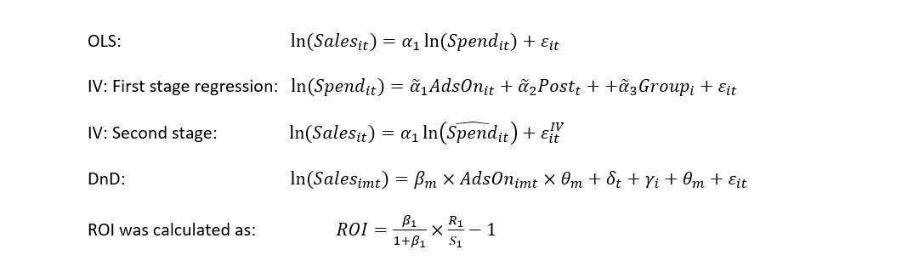

# Introduction

```{r setup, include = FALSE}
# Set knitr options
knitr::opts_chunk$set(echo = TRUE, message = FALSE, warning = FALSE)

library(dplyr)
library(ggplot2)
library(tidyr)
library(purrr)
library(knitr)

# Set up theme object for prettier plots
theme_jim <-  theme(legend.position = "bottom",
                    axis.text.y = element_text(size = 16, colour = "black"),
                    axis.text.x = element_text(size = 16, colour = "black"),
                    legend.text = element_text(size = 16),
                    legend.title = element_text(size = 16),
                    title = element_text(size = 16),
                    strip.text = element_text(size = 16, colour = "black"),
                    strip.background = element_rect(fill = "white"),
                    panel.grid.minor.x = element_blank(),
                    panel.grid.major.x = element_line(colour = "grey", linetype = "dotted"),
                    panel.grid.minor.y = element_line(colour = "lightgrey", linetype = "dotted"),
                    panel.grid.major.y = element_line(colour = "grey", linetype = "dotted"),
                    panel.margin.y = unit(0.1, units = "in"),
                    panel.background = element_rect(fill = "white", colour = "white"),
                    panel.border = element_rect(colour = "black", fill = NA))
```


## Overview

This document is split in to two distinct sections, The first covers an overview of existing literature on the effectiveness of paid search (Blake, Nosko & Tadelis, 2015). The second analyses data from RestaurantGrades in order to compare the effectiveness of their advertising methods.

The `R` code used for the analyses in the second section can be viewed in this report using the _Code_ buttons to toggle code viewing, on alternatively on the online [repository](https://github.com/jim89/dm_group).

This document has interactive elements and is best viewed using a modern web browser such as Mozilla Firefox or Google Chrome.

# Paid search effectiveness

## Summary of the paper's main contribution.

Blake, Nosko, Tadelis's paper "Consumer heterogeneity and paid search effectiveness: A large scale field experiment (2015)" found paid search term advertising on the brand name of a well-known brand e.g. "ebay" to be ineffective in increasing short term revenues. Big brand's names usually appear through natural search after the paid search which is displayed at the top, hence customers who were going to go on the website anyway are being intercepted by those paid links. 

Additionally, it was shown that non-brand search terms, e.g. "shoes", were effective in gaining new users to the site. However, those new user's purchase rates are low. Frequent users - who would have come on to the website anyway - also clicked on these links (and accounted for most of the advertising costs) with no effect on their spending. This heterogeneity of customers this is consistent with the informative view of advertising, that adverts only provide information on products, adding very weak persuasive power.

Given the findings, ROI for both brand and non-brand keyword ads were estimated to be negative in the short term. However, it causes new users to visit the site and could potentially deter competitors, so the effects for the longer term are unknown.

## The methodology used. 

Typical consumers who click on the brand and non-brand adlinks had purchase intentions so would have found a way to the ebay website regardless of adverts. The CPC model means that ad spend increases as these consumers go to purchase on ebay, hence ad spend rises along with sales, leading to the endogeneity of the independent variable, spend. Strictly speaking this is known as backwards causation, and causes E(_x_|_u_) !=0 for all _i_,_t_. Naively regressing sales on ad spending with OLS will result in biased estimates of the true effect of ad spend. This endogeneity of log(spend) problem is alleviated by estimating it using the IV _AdsOn_ a dummy variable for weather ads were being paid for or not in a region (made from the interaction of _Post_ a dummy for whether the test was running at t and _Group_ a dummy whether that region i keeping search spending on during the test). Differences in Differences regression can also be used to directly estimate the treatment effect of turning adverts on for m=11 different sections of consumers (by purchase frequency).


```{r show_equations, out.width = 600, out.height= 600, fig.retina = NULL, fig.align='center'}

```

Where _R1_ is estimated US 2012 revenues given ad spend =$2880.64m, and _S1_ is estimated spend on US 2010 search ads =$51m. _beta1_ is the estimate of change in ln(Revenue) from turning on Ads, (i.e. the variable of interest in the DnD regression). To obtain a comparable measure for OLS and IV, their _alpha1_ coefficients are multiplied by the _alphahat1_ coefficient in the first stage IV equation. 

## Based on this, how would you approach ad spending?

We provide two strategies for a company to approach ad spending to deliver both rapid returns and sustained growth:

.	Shift focus from paid media to owned and earned media for brand keywords. Users substituted paid search clicks for natural search clicks when querying brands. Companies could reallocate spending from low-performing paid search and invest in maximizing the value from owned media (such as a company website) and earned media (such as a blogger writing about your product) to boost organic Search-Engine Optimisation, then conduct a thorough technical site audit which aims to drive higher value for the corporate brand. Note, paid search for brand queries could be still effective for small/new entities that have no brand recognition.

.	Measure impact of paid media for non-brand keywords on granular level. The majority of paid non-brand clicks may not directly result in incremental sales; new/infrequent users were positively influenced by ads, but frequent users whose buying behavior was not influenced by ads accounted for most of the expenses. A company's digital buy can have many keywords and display ads by size, type, and placement, each with their own individual performance information. In such a data-rich environment, granular level analysis will identify significantly more value than reliance on misleading averages. 

Overall, companies should stop paying for the majority of the poor-performing keywords, only keeping important ones for strategic reasons.

# Comparing advertising methods

## The data

Data from RestaurantGrades ("RG") were provided which detailed the results from a large test that RG had implemented in order to test the effectiveness of a new advertising campaign.

These data covered 30,000 restaurants that were active on the RG platform forming a representative sample of the population of RG restaurants. Three groups of 10,000 restaurants (selected at random from the 30,000) were each assigned to one of three groups receiving the following advert delivery methods:

* 10,000 received free advertising on RG using RG's existing advert-delivery algorithm;
* 10,000 received free advertising on RG using a new ad-delivery algorithm that was significantly different from existing methods; and
* 10,000 received _no_ advertising on the RG network for the duration of the study.

Participating restaurants were not informed of their involvement. The data provided listed, for each restaurant: the group they were assigned to coded as 0 (no ads.), 1 (existing ad-delivery algorithm), and 2 (new ad-delivery algorithm); the number of pageviews received, calls and reservations received during the study; and the type of restaurant (either chain or independent).

```{r load_data}
grades <- readxl::read_excel("./data/Advertising-Experiments-at-RestaurantGrades-Spreadsheet-Supplement.xlsx", 
                             sheet = 2) %>% 
            tbl_df() %>% 
            mutate(restaurant_type = factor(restaurant_type, 
                                            levels = c("chain", "independent"),
                                            labels = c("Chain", "Independent")))
```

## Evaluation metrics

For each restaurant type, the funnel of customers from pageviews, to calls, and to reservations was visualised. This is displayed in figure one.

```{r funnel, fig.cap = "Figure 1: Customer funnel from pageviews to calls to reservations for chain and independent restaurants", fig.align='center', out.height=800, out.width=600}
grades %>% 
    gather(key, value, -treatment, -business_id, -restaurant_type) %>% 
    filter(key != "convert_rate") %>% 
    group_by(treatment, restaurant_type, key) %>% 
    summarise(value = sum(value)) %>% 
    mutate(key = factor(key, levels = c("pageviews", "calls", "reservations"),
                        labels = c("Pageviews", "Calls", "Reservations"))) %>% 
    ggplot(aes(x = treatment, y = value)) +
    geom_bar(stat = "identity", aes(fill = restaurant_type)) +
    facet_grid(key ~ restaurant_type, scales = "free") +
    scale_y_continuous(labels = scales::comma) + 
    scale_fill_manual(values = c("firebrick", "steelblue")) +
    guides(fill = guide_legend(title = "Restaurant Type")) +
    xlab("Ad. delivery method") +
    ylab("Value") +
    theme_jim +
    theme(strip.text = element_text(size = 14, colour = "black"))
```

It is noted that advertising under the current approach (group 1) produced more _views_ than no advertising (group 0). However this increase in views did not appear to translate in to an increased number of reservations. Therefore an evaluation metric needed to be determined that captured this fact. The ratio of reservations to pageviews was used (termed _conversion rate_) to model the effectiveness of each ad-delivery strategy. 

```{r create_metric}
# Define metric - use reservations / views, i.e. conversion
grades <- grades %>% 
  mutate(treatment = as.factor(treatment),
         convert_rate = reservations/pageviews)
```         

For each ad-delivery method and restaurant type, the range of conversion rates was identified and is visualised in figure two.

```{r vis_conv_rate, fig.cap = "Figure 2: Conversion rate per ad-delivery method and store type. The horizontal black bars show the mean of each group, and the width of the shape shows the distribution of the individual points in each group.", out.width = 800, out.height=600, fig.align='center'}
grades %>% 
  ggplot(aes(x = treatment, y = convert_rate)) +
  geom_violin(aes(fill = treatment), draw_quantiles = c(.5)) +
  facet_grid(restaurant_type ~ .) +
  scale_fill_brewer(type = "qual", palette = "Dark2") +
  scale_y_continuous(labels = scales::percent) +
  xlab("") +
  ylab("Conversion Rate") +
  guides(fill = guide_legend(title = "Ad-delivery method")) +
  theme_jim
```

From the visualisation in figure two, it appears that the conversion rates are not the same across the three groups in each restaurant type. Indeed it appears that displaying _no_ ads (group 0) produces a better conversion rate than the current ad-delivery design. And that the new algorithm out-performs both the current method _and_ the display of no ads when measured by conversion rate. 

## Statistical differences

Statistical differences between the three groups for each restaurant type were examined. The differences in advertising effectiveness were compared using a one-way analysis of variance procedure of conversion rate as predicted by ad-delivery method. This test compares the means of a each group and assesses the differences against the null hypothesis that they are all equal, i.e.:

\begin{equation}
H_0 : \mu_1 = \mu_2 = \mu_3
\end{equation}

The results of these procedures are displayed in tables one and two below.

```{r nest_and_aov}
# Creating fitting aov function
fit_aov <- function(dat) {
    fit <- aov(convert_rate ~ treatment, data = dat)
    fit <- broom::tidy(fit)
}
    
# Group and apply the function
grades_aov <- grades %>% 
    group_by(restaurant_type) %>% 
    nest() %>% 
    mutate(aov = data %>% map(fit_aov))

# Set aov kable names
aov_names <- c("Term", "Df", "Sum Squares", "Mean Square", "F-Statistic", "p-Value")
    
kable(grades_aov$aov[[1]], col.names = aov_names, caption = "Table 1: Analysis of Variance for chain restaurants", digits = 2)

kable(grades_aov$aov[[2]], col.names = aov_names, caption = "Table 2: Analysis of Variance for independent restaurants", digits = 2)
```

The large and statistically significant F-statistics for the advert-delivery method coefficient for both chain and independent restaurants mean it is possible to reject the null that there is an equal mean across the three groups, i.e. the three groups are _statistically_ different.

Having determined that, within each restaurant type, each advertising method was different from the others, it was necessary to determine _how_ they differed. For this, Tukey Honest Significant Differences were used to generate the 95% confidence intervals for the differences in the average values between each of the three goups. 

```{r tukey}
fit_tukey <- function(dat) {
    fit <- aov(convert_rate ~ treatment, data = dat)
    fit <- TukeyHSD(fit, conf.level = 0.95)
    fit <- broom::tidy(fit)
    return(fit)
}    

# Group and apply the function
grades_tukey <- grades %>% 
    group_by(restaurant_type) %>% 
    nest() %>% 
    mutate(tukey = data %>% map(fit_tukey))

tukey_names <- c("Comparison", "Estimate", "Lower 95% interval", "Upper 95% interval", "p-Value")

kable(grades_tukey$tukey[[1]], col.names = tukey_names,
      caption = "Table 3: Tukey Honest Significant Differences for ad-delivery methods in chain restaurants")

kable(grades_tukey$tukey[[2]], col.names = tukey_names,
      caption = "Table 4: Tukey Honest Significant Differences for ad-delivery methods in independent restaurants")
```

From tables three and four it is seen that, for both types of restaurant, the current avertising method resulsts in a _lower_ conversion rate than no advertising at all (comparison 1-0). Similarly, the new ad-delivery algorithm results in a _higer_ conversion rate than either the current method or displaying no adverts at all (comparisons 2-0 and 2-1). All these differences are statistically significant.

## Conclusion

It is therefore possible to recommend the new advertising method. 

Simple statistical analysis shows the three methods to be different when measured by conversion rate (the ratio of pageviews to reservations). When determining the direction of these differences, it has been shown that the current method is statistically _less_ effective than displaying _no_ advertisements at all! The new method out-performs both the current method _and_ displaying no advertisements at a statistically significant rate. 

Therefore the new ad-delivery algorithm is highly recommended. 

One potential explanation of the differences in conversion rates could be how the advertisments are set up. In the current advertisement scheme, the current advertisement will send the customer to a restaurant close to the restaurant that the customer is currently looking at. In the alternative advertisement scheme, the alternative advertisement will send the customer to a restaurant with similar ratings and hours but not in the same area. 

As shown in the graphs above, the percentage of customers clicking on the current advertisment of the restaurant is high but the conversion rate of turning those page views into reservation is low. We propose two reasons for that. The first reason is that the current advertisement sends the customer to a restaurant with a different ranking and price point. Hence the customer lost interest after the page and did not call the restaurant which explains the drop between page views and the customer calling the restaurant. The second reason is that the advertisments are showing restaurants that are full and therefore a table could not be reserved. Usually, for a customer to click on ad, it means the restaurant the customer is looking at is full and is looking for an alternative. If the restaurants from the ad are restaurants from the same area there is a high possibility that those restaurants are full as well. Most customers will generally try restaurants near the area they are looking at first. For the alternative advertisement scheme, the customer will be booking restaurants from another area which might have more free space. Therefore even though the current advertisment is more effective in creating more interest, it is less effective as it does not create more reservations as those restaurants are already full. We would need to perform additional data collection and investigation to test these two hypothesis.

# References

* _Simultaneous Statistical Inference_, 1981, R. G. Miller, Springer;
* _Analysis of variance; designed experiments_, 1992, J. M. Chambers, A Freeny, and R. M. Heiberger.