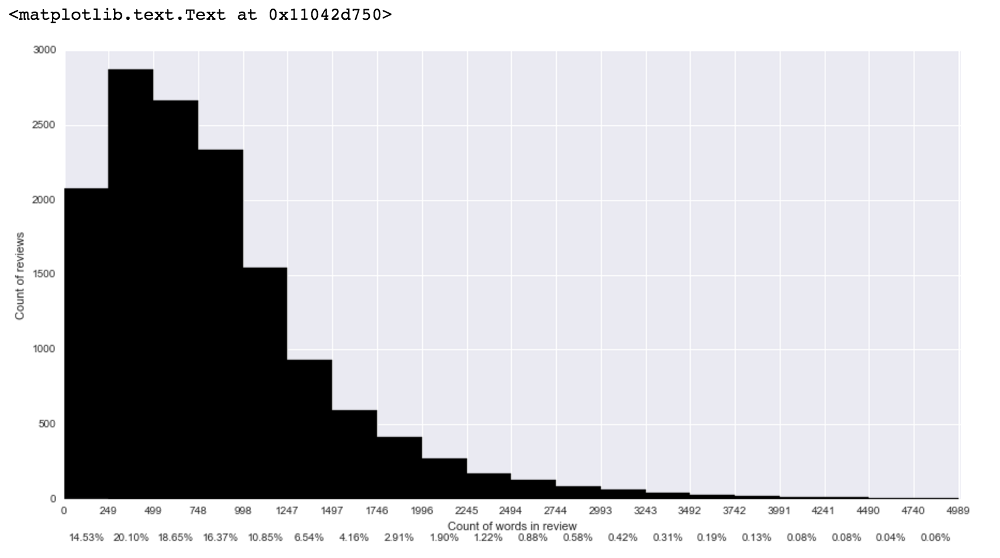
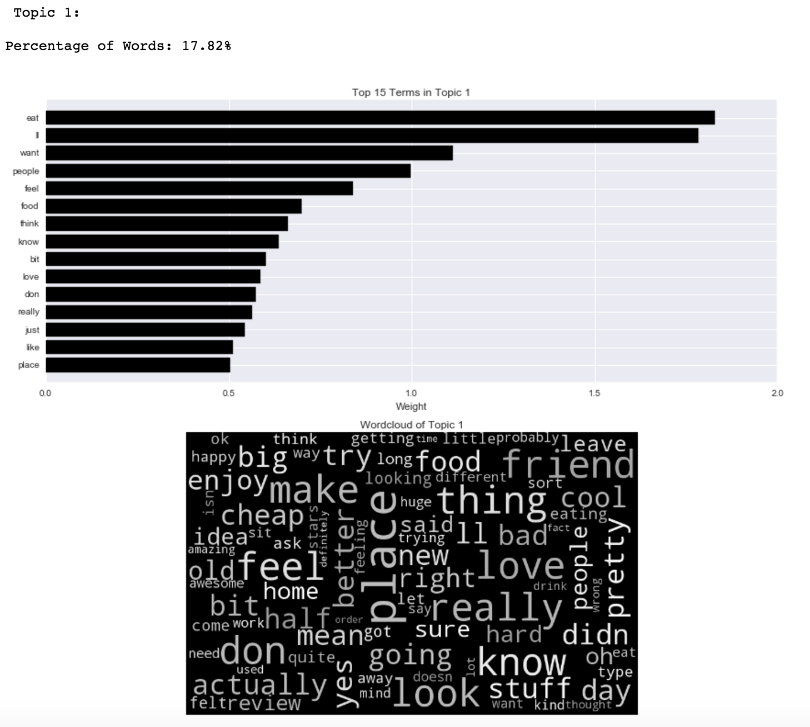

```{r setup, include=FALSE}
# Set all code chunks to be printed in to the document (echo = T) but do not _run_
# the code inside them (eval = F)
knitr::opts_chunk$set(echo = TRUE, eval = FALSE)
```

```{r include=FALSE}
# Load Python packages
import json
import ftfy
import nltk
import pycountry
import random 
import seaborn
import numpy as np
import pandas as pd
import collections as cllt
import sklearn as sk
import matplotlib.pyplot as plt

from nltk import word_tokenize
from os import path
from glob import glob
from scipy.misc import imread
from textblob import TextBlob
from wordcloud import WordCloud
from IPython.display import display, HTML
from sklearn.decomposition import NMF
from sklearn.feature_extraction.text import TfidfVectorizer
```


# Executive Summary

## Goals and Introduction

You work for a large corporation that owns a collection of restaurants of different types. Currently it is evaluating the location, type, and characteristics (cuisine, price point, design, marketing strategy) and positioning of a new restaurant in Edinburgh (if you know the local habits, you can give better insight).
Your task is to analyse the dataset and give recommendations on strategy, based on the reviews, location (either neighbourhood or zipcode level) and competition. Also estimates on volumes and revenues of the potential undertaking. You may have to check out what the price-range attributes signify by visiting the Yelp website.

## Methodology

# Analysis - Review 

## Introduction

The goal of this analysis is to point out demand and preference of customers from a large amount of reviews, with high dimensionality. These topics can provide meaningful insights to opening a new restaurant by considering what customers care about in order to increase the Yelp ratings, which directly affects the revenue. But how can restaurant understand the demands of its customers from a large amount of reviews? For a relatively small collection of reviews, it may be possible to manually inspect and classify the contents of reviews into specific categories based on similarity. But to partition large volumes of text, the process would be extremely time consuming. Topic modelling greatly reduces the time needed to perform the classification and understand the actual contents. We hope to use topic modelling to identify what users care about most when giving their rating stars, and ultimately determine what a new restaurant should be doing in order to receive high ratings.

In this study, I applied a non-negative matrix factorization (NMF) approach for the extraction and detection of concepts or topics from reviews. NMF introduces a technique that simultaneously perform dimension reduction and clustering that identifies semantic features in a document collection and groups the documents into clusters on the basis of shared semantic features [1]. The extracted topics from 1-star and 2-star reviews were used as an indicator of bad practice whereas extracted topics from 4-star and 5-star reviews were used as an indicator of good practice for operating a restaurant.

## Description of datasets

Import the datasets.

```{r}
business = pd.read_csv("edinburgh.csv",header=0)
checkin = pd.read_csv("edinCheckin.csv",header=0)
review = pd.read_csv("edinReview.csv",header=0)
tip = pd.read_csv("edinTip.csv",header=0)
user = pd.read_csv("edinUser.csv",header=0,usecols=range(0,23))
```

The main dataset in this study was 'yelp_academic_dataset_review.json' and summary of the dataset is shown below.

```{r}
# Replace nan with blank space
review=review.replace(np.nan,' ', regex=True)

# Summary of dataset
review.info()

```


```{r eval = TRUE, echo=FALSE}

```

The text of reviews is full of punctuations, numbers and capital letters, further cleansing of data is required for text analysis.

```{r}
review.text.head(10)
```

```{r eval = TRUE, echo=FALSE}

```

## Data Cleansing

Clean up the text in review dataset.
```{r}
# Referenced Regular Expression for email cleanup idea: 
def cleanup(text):

    # Make text lower case
    for f in re.findall("([A-Z]+)", text):
        text = text.replace(f, f.lower())
    
    # Remove escape symbols
    text = text.replace('\r', " ")
    text = text.replace('\n', " ")
    
    # Remove all non-ascii characters in the string
    text=unicode(text, 'ascii', 'ignore')

    # Creata a list of reg tools
    cleanuptools = [
    # Dates
    r"(monday|tuesday|wednesday|thursday|friday|saturday|sunday)",
    # Removing months
    r"january|february|march|april|may|june|july|august|september|october|november|december",
    # Punctuation and numbers to be removed
    r'[-|.|?|!|,|"|:|;|()|0-9]',
    ]
    
    for tool in cleanuptools:
        text = re.sub(tool," ", text)
    return text


# Constructing a list for stopwords 
stopwords = []

# Add scikit-learn's CountVectorizer's stop list to the created list
stopwords = sk.feature_extraction.text.ENGLISH_STOP_WORDS

# Apply the created functions to clean up text
review.text=review.text.apply(cleanup)

# Cleaned text
review.text[28]
```

Text after cleansing:

```{r eval = TRUE, echo=FALSE}
knitr::include_graphics("Siang/3.png")
```


## Inspection of review contents

### Reviews VS Stars
It is crucial to only include reviews with a considerable amount of contents as the topic modelling will not be able to extract any insight from a short review. The length of reviews was therefore analysed and a minimum requirement on the length of review was implemented.

```{r}
f, ax = plt.subplots(figsize=(15,7.5))
n, bins, patches = ax.hist(review.text.apply(len),facecolor='black',bins=20)
ax.set_xticks(bins)
bin_centers = 0.5 * np.diff(bins) + bins[:-1]
for count, x in zip(n, bin_centers):
    percent = '{:.2f}%'.format((float(count) / n.sum())*100)
    ax.annotate(percent, xy=(x, 0), xycoords=('data', 'axes fraction'),
    xytext=(0, -32), textcoords='offset points', va='top', ha='center')
ax.set_xlabel('Count of reviews')
ax.set_ylabel('Count of words in review')
```

```{r eval = TRUE, echo=FALSE}

```

It can be seen that almost 95% of reviews have length of more than 500 words, therefore, it is not necessary to remove any short reviews. The distribution of ratings was also examined to avoid inbalanced datasets.

```{r}
review.stars.value_counts(sort=False).plot(kind='bar',color="black")
plt.title('Reviews By Star');
```

```{r eval = TRUE, echo=FALSE}

```

Inituitively, we thought there would be more 1-star and 5-star reviews, however, the data shows otherwise, and the majority of reviews were 4-star and 5-star. It is also important to check the quality of reviews by examining their numbers of votes.

### Reviews VS Votes
The majority of reviews have only one vote regardless of the type of vote (cool, useful or funny). Originally, we planned to only include reviews with at least two votes. However, by doing so, it would remove a significant amount of text from this analysis. We decided not to remove any reviews based on their numbers of votes.

#### Vote for cool

```{r}
pd.crosstab(review.stars,review.votes_cool[review.votes_cool!=0],margins=True)
```

```{r eval = TRUE, echo=FALSE}

```

#### Vote for funny

```{r}
pd.crosstab(review.stars,review.votes_funny[review.votes_funny!=0],margins=True)
```

```{r eval = TRUE, echo=FALSE}
knitr::include_graphics("Siang/7.png")
```

#### Vote for useful

```{r}
pd.crosstab(review.stars,review.votes_useful[review.votes_useful!=0],margins=True)
```

```{r eval = TRUE, echo=FALSE}

```


## Methodology and Procedure

### Dividing dataset

To simplify the classification of topics - Good or Bad reviews. Reviews were split into two groups and 3-star reviews were excluded in this analysis due to the mixed expression of customers (three stars could be a good or a bad review). First group contains 1-star and 2-star reviews, which were later interpreted as bad reviews and second group contains 4-star and 5-star reviews, which were later interpreted as good reviews.


```{r}
# Split the dataset into 2 categories: 1,2 stars and 4,5 stars

review_bad = review[(review.stars == 1) | (review.stars == 2)]
review_good = review[(review.stars == 4) | (review.stars == 5)]

review_good.text.head(10)
```

Example of good reviews:

```{r eval = TRUE, echo=FALSE}
knitr::include_graphics("Siang/9.png")
```

### Text feature extraction

The text is a sequence of alphabets that cannot be fed directly to the algorithms themselves as most of them expect numerical feature vectors with a fixed size rather than the raw text documents with variable length. Therefore, a range of functions from python scikit-learn package was used to extract numerical features from text content, namely [1]-[3]:

* tokenizing strings and giving an integer id for each possible token, for instance by using white-spaces and punctuation as token separators.
* counting the occurrences of tokens in each document.
* normalizing and weighting with diminishing importance tokens that occur in the majority of samples / documents.

In a large text corpus, some words will be very present (e.g. “the”, “a”, “is” in English) hence carrying very little meaningful information about the actual contents of the document. If we were to feed the direct count data directly to a classifier those very frequent terms would shadow the frequencies of rarer yet more interesting terms. In order to reduce the influence of terms appearing frequently across the entire corpus, we applied TF-IDF term re-weighting functions to normalize the data. TfidfVectorizer function combines the functions of TF-IDF and vectorization (Vectorization is a process combining tokenizing, counting and normalization) allowing to build a document-term matrix for the corpus of documents:

```{r}
#Vectorization
tfidfvectorizer_bad = TfidfVectorizer(max_features=15000, ngram_range=(1, 2), stop_words = stopwords,
                                 strip_accents="unicode", use_idf=True, norm="l2", min_df = 5)
tfidfvectorizer_good = TfidfVectorizer(max_features=15000, ngram_range=(1, 2), stop_words = stopwords,
                                 strip_accents="unicode", use_idf=True, norm="l2", min_df = 5)

#Create term document matrix for separate datasets
term_document_matrix_bad = tfidfvectorizer_bad.fit_transform(review_bad.text)
term_document_matrix_good = tfidfvectorizer_good.fit_transform(review_good.text)
```

### Topic Modelling

In topic modeling, there are several methods for learning abstract topics in a collection of documents. NMF is a new and emerging method of unsupervised learning to discover hidden topics. We applied the scikit-learn implementation of NMF with NNDSVD initialization. Nonnegative Double Singular Value Decomposition (NNDSVD) is typically used for overcoming sparseness of data in document-term matrix [8]. Here I set the number of topics to be equal to 25 and run NMF for 200 iterations, and then get the factors W and H from the resulting model:

```{r}
# 1-star + 2-star reviews
nmfmodel_bad = sk.decomposition.NMF(init="nndsvd", n_components=25, max_iter=200).fit(term_document_matrix_bad)
W_bad = nmfmodel_bad.fit_transform(term_document_matrix_bad);
H_bad = nmfmodel_bad.components_
# W (number of reviews,number of topics) and H (number of topics, number of features)
print "Generated factor W of size %s and factor H of size %s for bad reviews" \
% ( str(W_bad.shape), str(H_bad.shape) )

# 4-star + 5-star reviews
nmfmodel_good = sk.decomposition.NMF(init="nndsvd", n_components=25, max_iter=200).fit(term_document_matrix_good)
W_good = nmfmodel_good.fit_transform(term_document_matrix_good);
H_good = nmfmodel_good.components_
# W (number of reviews,number of topics) and H (number of topics, number of features)
print "Generated factor W of size %s and factor H of size %s for good reviews" \
% ( str(W_good.shape), str(H_good.shape) )
```

```{r eval = TRUE, echo=FALSE}
knitr::include_graphics("Siang/10.png")
```

## Results

### Top Terms by each topic {.tabset .tabset-fade}

Write a range of functions to plot graphs to present the top topics discovered by NMF model and create a list of features (tokenized words) generated from NMF model.

```{r}
# Create a colour series for graph plotting
def grey_color_func(word, font_size, position, orientation, random_state=None, **kwargs):
    return "hsl(0, 0%%, %d%%)" % random.randint(60, 100)

# Writting functions to show top words in each topic
def TopTermsByTopic(nmfmodel, features, top):
    for index, topic in enumerate(nmfmodel.components_):
        print "\n Topic {}: \n".format(index+1)
        print "Percentage of Words: {:.2%}\n".format(np.count_nonzero(topic) / 41961.)
        
        top_words = [features[i] for i in nmfmodel.components_[index].argsort()[::-1][:top]]
        topic_words = ' '.join(top_words)

        #Prepare data for horizontal bar charts
        top15_index = nmfmodel.components_[index].argsort()[::-1][:15]
        top15_topic = sorted(topic[top15_index],reverse=False)

        #Prepare data for wordclouds
        wc = WordCloud(max_font_size=80,relative_scaling=.5,width=800,height=500).generate(topic_words)
       
        #Create a space for graphs
        fig, ax = plt.subplots(2,figsize=(12,10))
        rect1 = ax[0].barh(.5 + np.arange(15) + .5, top15_topic, color="black", align="center")
        rect2 = ax[1].imshow(wc.recolor(color_func=grey_color_func, random_state=3))
        
        #Subplot 1 - Horizontal Bar Chart
        ax[0].set_title("Top 15 Terms in Topic {}".format(index + 1))
        ax[0].set_xlabel("Weight")
        ax[0].set_yticks(.5 + np.arange(15)+ .5)
        ax[0].set_yticklabels([features[i] for i in topic.argsort()[::-1][:15]])
        ax[0].grid(True)
        
        #Subplot 2 - WordCloud
        ax[1].axis("off")
        ax[1].set_title("Wordcloud of Topic {}".format(index + 1))
        
        #Show the graphs
        plt.tight_layout()
        plt.show()
        
        
#Extracting the feature names
features_bad= tfidfvectorizer_bad.get_feature_names()
features_good= tfidfvectorizer_good.get_feature_names()
 
```


This section shows the most significant topics discovered by NML model, also, the top 15 highest weighted terms were presented on a horizontal bar chart along with the rest of the terms on a word cloud. Experiments suggests 25 topics are optimal, this number allows a clearer separation of topics.

#### Bad Reviews: 1-star and 2-star reviews
```{r}
TopTermsByTopic(nmfmodel_bad, features_bad, 100)
```

Example of Topic 1 for bad reviews: 
```{r eval = TRUE, echo=FALSE}
knitr::include_graphics("Siang/11.png")
```

#### Good Reviews: 4-star and 5-star reviews

```{r}
TopTermsByTopic(nmfmodel_good, features_good, 100)
```

Example of Topic 1 for good reviews: 
```{r eval = TRUE, echo=FALSE}

```


###Summary of topics {.tabset .tabset-fade}

This section summarises topics discovered by NMF model from bad reviews text. An attempt to interpret the contents of each topic was made, keywords in each topic were manually examined and a description of each topic was then assigned.

#### Bad Reviews: 1-star and 2-star reviews
```{r}

data_bad = {'Index of Topics':['Topic 1','Topic 2','Topic 3','Topic 4','Topic 5','Topic 6','Topic 7','Topic 8'
                           ,'Topic 9','Topic 10','Topic 11','Topic 12','Topic 13','Topic 14','Topic 15'
                           ,'Topic 16','Topic 17','Topic 18','Topic 19','Topic 20',
                            'Topic 21','Topic 22','Topic 23','Topic 24','Topic 25']
        ,'Type of Topics':['Bad service from manager and waiter/waitress ', 'Bad Coffee Shop',
                           'Bad Chicken Dishes (Fried, Boiled, Curry)',
                           'Bad Italian Foods (Pizza and Pasta: Toppings, base, sauce, etc.)',
                           'Bad Fried Chips (Soggy Batter)','Bad Burger', 'Unknown Topic',
                           'Bad wait and time management','Bad Experience and Services',
                           'Bad Restaurant (Birthplace of Harry Potter)','Bad Afternoon Tea',
                           'Unfriendly and Rude Staffs','Bad Chinese Sweet and Sour Foods',
                           'Unknown Topic','Bad Mexican Foods','Bad Place for drinks (too quiet)',
                           'Bad Japanese Foods (Tuna, Miso Soup)','Bad Prices','Bad Breakfast (Eggs Benedict)',
                           'Bad Wait and Time Management','Bad Noodles', 'Good Comments in Bad Reviews',
                           'Expensive Place for Tourists', 'Hot Temperature','Bad Thai Foods'                           
                           ]
       } 

topic_table_bad = pd.DataFrame(data_bad)
display(topic_table_bad)
```

```{r eval = TRUE, echo=FALSE}

```


#### Good Reviews: 4-star and 5-star reviews

```{r}
data_good = {'Index of Topics':['Topic 1','Topic 2','Topic 3','Topic 4','Topic 5','Topic 6','Topic 7','Topic 8'
                           ,'Topic 9','Topic 10','Topic 11','Topic 12','Topic 13','Topic 14','Topic 15'
                           ,'Topic 16','Topic 17','Topic 18','Topic 19','Topic 20',
                            'Topic 21','Topic 22','Topic 23','Topic 24','Topic 25']
        ,'Type of Topics':['Unknown Topic','Good Quality foods','Good Place and Atmosphere',
                           'Good Bars and Pubs', 'Good Scottish Breakfast',
                           'Good Fish and Chips with nice peas','Good Thai Foods with decent prawn',
                           'Good Indian Foods', 'Good Menu','Good Beef Burger with decent sweet potatoes',
                           'Good Price and Value','Good Sandwiches', 'Good Italian Foods (Pasta and Pizza)',
                           'Good chocolates and ice creams','Good Coffee Shops with Nice Artisan and Expresso',
                           'Good Japanese foods (Bento,Nigiri,Kanpai)','Good Mexican Burritos and Tacos',
                           'Excellent Services', 'Good Afternoon Tea', 'Good BBQ Shops (crackling pork, haggis)',
                           'Unknown German Reviews', 'Friendly Staff','Good Foods', 'Good Vegetarian Restaurants',
                           'Good Potato Shops'
                           ]
       } 

topic_table_good = pd.DataFrame(data_good)
display(topic_table_good)
```

```{r eval = TRUE, echo=FALSE}

```

## Recommendation

The topics extracted by NMF model from both good and bad reviews were used to make the recommendation below.

**Opportunities to explore when opening a restaurant in Edinburgh:**

* Customers are not satisfied with the type of batter for fish and chips in Edinburgh, which was complained to be too soggy. (Bad Review Topic 5)
* Customers are also not particularly happy with chicken dishes in Edinburgh. (Bad Review Topic 3)
* Foods and drinks at a cafe where JK Rowling visited were not satisfying and received a lot of complaints. (Bad Review Topic 10)
* Sweet and sour chickens are not satisfying at chinese restaurants in Edinburgh. (Bad Review Topic 13)
* Thai Foods for lunch are not good (Bad Review Topic 25)
* Current noodle shops in Edinburgh are bad (Bad Review Topic 21)
* Good atmosphere, location, friendly staff and price-to-value could enhance customer experience (Good Review Topics 2,3,11 and 22)

**Areas to avoid and improve when opening a restaurant in Edinburgh:**

* Customers complained about bad services from rude and unfriendly waiter and waitress (Bad Review Topics 1 and 12)
* Customers complained about long wait (Bad Review Topic 8)
* Customers complained about room temperature (Bad Review Topic 24)
* Customers complained about bars and pubs that are too quiet (Bad Review Topic 16)

**For sectors where businesses are doing very well would also mean new entrants could face a big challenge to enter these sectors.**

* Good Review Topic 4 appeared in 16.57% of reviews, that implies bars and pubs are providing very good services in Edinburgh.
* Good Review Topic 15 appeared in 13.32% of reviews, that means current coffee shops are providing very good coffees and services.
* BBQ shops are doing very well in Edinburgh. (Good Review Topic 20)
* Potato shops are doing very well in Edinburgh. (Good Review Topic 25)

In conclusion, insights above that were extracted by topic modelling are very useful for a company that plans to open a new restaurant in Edinburgh, for example, it was clear that customers are not satisfied with the current fish and chips and chicken dishes in Edinburgh, a new restaurant could potentially target these specific sectors to fullfill the customer demand. Also, company should be careful with certain issues that were discovered from bad reviews, for example, topics such as unfriendly staffs, long wait and uncomfortable room temperature that frequently appeared in bad reviews could negatively affect customer experience. Finally, sectors that are doing very well in Edinburgh such as bars, pubs, BBQ and Potato shops are the areas that a new restraunt may not want to consider in order to avoid fierce competition.


# Analysis - Location and Competition


# Analysis - Type and Characteristics

In this part, we will classify different kind of restaurants with hierachical clustering technique to find out different category of restaurants and analyse their performance in different zips. From the result, we can then analyse the best location of our restaurants by recognising out-performing and under-performing areas for each type of restaurants.

```{r include=FALSE}

df2=pd.read_csv("C:/Users/cheukkin.Warwick/Desktop/dm_group/final_group_project/Kane Wu/edinburgh.csv",header=0)
df2=df2.set_index(df2.ix[:,0])
df2.drop(df2.columns[0], axis=1,inplace=True)
df3=pd.DataFrame()
df3["business_id"]=df2["business_id"]
attributes_cols=[col for col in df2.columns if 'attributes' in col]
df3=pd.concat([df3, df2.apply(lambda x: f(x,"attributes_Ambience"),axis=1)], axis=1)
df3=pd.concat([df3, df2.apply(lambda x: f(x,"attributes_Dietary Restrictions"),axis=1)], axis=1)
df3=pd.concat([df3, df2.apply(lambda x: f(x,"attributes_Good For"),axis=1)], axis=1)
df3=pd.concat([df3, df2.apply(lambda x: f(x,"attributes_Music"),axis=1)], axis=1)
df3=pd.concat([df3, df2.apply(lambda x: f(x,"attributes_Parking"),axis=1)], axis=1)
df3=pd.concat([df3,pd.get_dummies(df2.attributes_Alcohol)], axis=1)
df3=pd.concat([df3,pd.get_dummies(df2["attributes_Ages Allowed"])], axis=1)
df3=pd.concat([df3,pd.get_dummies(df2.attributes_Attire)], axis=1)
df3=pd.concat([df3,pd.get_dummies(df2["attributes_Price Range"])], axis=1)
df3['attributes_BYOB/Corkage_TF']=df2["attributes_BYOB/Corkage"]=="yes_free"
df3=pd.concat([df3,pd.get_dummies(df2["attributes_Noise Level"])], axis=1)
df3 = df3.drop(0, 1)
#df3['attributes_Noise Level_scaled']=df2['attributes_Noise Level'].replace(to_replace="quiet",value=1)
#df3['attributes_Noise Level_scaled']=df3['attributes_Noise Level_scaled'].replace(to_replace="average",value=2)
#df3['attributes_Noise Level_scaled']=df3['attributes_Noise Level_scaled'].replace(to_replace="loud",value=3)
#df3['attributes_Noise Level_scaled']=df3['attributes_Noise Level_scaled'].replace(to_replace="very_loud",value=4)
df3['attributes_Smoking_NO']=df2['attributes_Smoking']=="NO"
df3['attributes_Smoking_OUTDOOR']=df2['attributes_Smoking']=="outdoor"
df3['attributes_By Appointment Only']=df2['attributes_By Appointment Only']
df3['attributes_Caters']=df2['attributes_Caters']
df3['attributes_Coat Check']=df2['attributes_Coat Check']
df3['attributes_Caters']=df2['attributes_Caters']
df3['attributes_Drive-Thru']=df2['attributes_Drive-Thru']
df3['attributes_Good For Dancing']=df2['attributes_Good For Dancing']
df3['attributes_Good For Groups']=df2['attributes_Good For Groups']
df3['attributes_Good for Kids']=df2['attributes_Good for Kids']
df3['attributes_Good for Kids']=df2['attributes_Good for Kids']
df3['attributes_Happy Hour']=df2['attributes_Happy Hour']
df3['attributes_Has TV']=df2['attributes_Has TV']
df3['attributes_Outdoor Seating']=df2['attributes_Outdoor Seating']
df3['attributes_Has TV']=df2['attributes_Has TV']
df3['attributes_Take-out']=df2['attributes_Take-out']
df3['attributes_Takes Reservations']=df2['attributes_Takes Reservations']
df3['attributes_Waiter Service']=df2['attributes_Waiter Service']
df3['attributes_Wheelchair Accessible']=df2['attributes_Wheelchair Accessible']

df3=df3.fillna(0)
df3=df3.replace(to_replace=False,value=0)
df3=df3.replace(to_replace=True,value=1)

df3["Non-empty"]=(df3!=0).any(1)

df4=pd.read_csv("C:/Users/cheukkin.Warwick/Documents/dm_grp/dm_group/edinburgh.csv")
df4=df4.set_index(df4.ix[:,0])
df4.drop(df4.columns[0], axis=1,inplace=True)
df5=pd.concat([df3,pd.get_dummies(df4.cusine)],axis=1)
df5["Non-empty"]=(df5!=0).any(1)

#To build the functions for clustering
def fancy_dendrogram(*args, **kwargs):
    max_d = kwargs.pop('max_d', None)
    if max_d and 'color_threshold' not in kwargs:
        kwargs['color_threshold'] = max_d
    annotate_above = kwargs.pop('annotate_above', 0)

    ddata = dendrogram(*args, **kwargs)

    if not kwargs.get('no_plot', False):
        plt.title('Hierarchical Clustering Dendrogram (truncated)')
        plt.xlabel('sample index or (cluster size)')
        plt.ylabel('distance')
        for i, d, c in zip(ddata['icoord'], ddata['dcoord'], ddata['color_list']):
            x = 0.5 * sum(i[1:3])
            y = d[1]
            if y > annotate_above:
                plt.plot(x, y, 'o', c=c)
                plt.annotate("%.3g" % y, (x, y), xytext=(0, -5),
                             textcoords='offset points',
                             va='top', ha='center')
        if max_d:
            plt.axhline(y=max_d, c='k')
    return ddata
    
def hclst(data,method,distance):
    from scipy.cluster.hierarchy import cophenet
    from scipy.spatial.distance import pdist
    Z=linkage(data,method=method,metric=distance)
    c, coph_dists = cophenet(Z , pdist(data,metric=distance))
    # calculate full dendrogram'
    plt.figure(figsize=(25, 10))
    fancy_dendrogram(
        Z,
        truncate_mode='lastp',
        p=12,
        leaf_rotation=90.,
        leaf_font_size=12.,
        show_contracted=True,
        annotate_above=10,  # useful in small plots so annotations don't overlap
    )
    plt.show()
    
    plt.figure(figsize=(25, 10))
    plt.title('Hierarchical Clustering Dendrogram')
    plt.xlabel('sample index')
    plt.ylabel('distance')
    dendrogram(
        Z,
        leaf_rotation=90.,  # rotates the x axis labels
        leaf_font_size=8.,  # font size for the x axis labels
    )
    plt.show()
    return(Z,c,coph_dists)
    
```

##Restaurants Types Analysis

We have total 1215 restaurants in our dataset with 55 of them having no attributes at all. Amount these 1215 restaurants, we clustered them in to 5 different categories to analyse the location and density of different type restaurants in different regions within the city.

After considering different distance metrics and linkage, Euclidean distance metric and ward linkage are chosen for their simplicity and better structured dendrogram. 

```{r}
#Consider a few different linkage 
df3_filtered=df3.loc[(df3!=0).any(1)]
df3_filtered=df3_filtered.iloc[:,0:58]
R1=hclst(df3_filtered.iloc[:,1:58],"ward","euclidean")
df3_filtered
```

```{r}
#To determine cuts by different measures
from scipy.cluster.hierarchy import inconsistent
depth = 20
incons1 = inconsistent(R1[0], depth)
incons1[-20:]
plt.figure(figsize=(25, 10))
plt.title('Inconsistency Measure of last 20 Merges with deth ' + str(depth))
plt.xlabel('Merges')
plt.ylabel('Inconsistency')
plt.plot(incons1[-20:,3])
plt.show()
#Determine cuts By Elbow
plt.figure(figsize=(25, 10))
plt.title('Height of the last 20 Merges')
plt.xlabel('Merges from the last merge')
plt.ylabel('Height')
last = R1[0][-20:, 2]
last_rev = last[::-1]
idxs = np.arange(1, len(last) + 1)
plt.plot(idxs, last_rev)
plt.show()

plt.figure(figsize=(25, 10))
plt.title('Rate of increase in Height between Merges')
plt.xlabel('Merges from the last merge')
plt.ylabel('Rate')
acceleration = np.diff(last, 2)  # 2nd derivative of the distances
acceleration_rev = acceleration[::-1]
plt.plot(idxs[:-2] + 1, acceleration_rev)
plt.show()


from scipy.cluster.hierarchy import fcluster
max_d = 15
clusters = fcluster(R1[0], max_d, criterion='distance')
df3_filtered['cluster']=clusters
```

Now to determine cuts by different measures.

```{r}
#To determine cuts by different measures
from scipy.cluster.hierarchy import inconsistent
depth = 20
incons1 = inconsistent(R1[0], depth)
incons1[-20:]
plt.figure(figsize=(25, 10))
plt.title('Inconsistency Measure of last 20 Merges with deth ' + str(depth))
plt.xlabel('Merges')
plt.ylabel('Inconsistency')
plt.plot(incons1[-20:,3])
plt.show()
#Determine cuts By Elbow
plt.figure(figsize=(25, 10))
plt.title('Height of the last 20 Merges')
plt.xlabel('Merges from the last merge')
plt.ylabel('Height')
last = R1[0][-20:, 2]
last_rev = last[::-1]
idxs = np.arange(1, len(last) + 1)
plt.plot(idxs, last_rev)
plt.show()

plt.figure(figsize=(25, 10))
plt.title('Rate of increase in Height between Merges')
plt.xlabel('Merges from the last merge')
plt.ylabel('Rate')
acceleration = np.diff(last, 2)  # 2nd derivative of the distances
acceleration_rev = acceleration[::-1]
plt.plot(idxs[:-2] + 1, acceleration_rev)
plt.show()


from scipy.cluster.hierarchy import fcluster
max_d = 15
clusters = fcluster(R1[0], max_d, criterion='distance')
df3_filtered['cluster']=clusters
```

From the plots, a cut with 5 clusters gives the most desired result.
Now to visualise the results.

```{r}
from scipy.cluster.hierarchy import fcluster
max_d = 15
clusters = fcluster(R1[0], max_d, criterion='distance')
df3_filtered['cluster']=clusters

#To visualise results
C1=df3_filtered[df3_filtered.cluster==1]
C1=C1.drop(C1.columns[57], axis=1)
C1=C1.describe()
C2=df3_filtered[df3_filtered.cluster==2]
C2=C2.drop(C2.columns[57], axis=1)
C2=C2.describe()
C3=df3_filtered[df3_filtered.cluster==3]
C3=C3.drop(C3.columns[57], axis=1)
C3=C3.describe()
C4=df3_filtered[df3_filtered.cluster==4]
C4=C4.drop(C4.columns[57], axis=1)
C4=C4.describe()
C5=df3_filtered[df3_filtered.cluster==5]
C5=C5.drop(C5.columns[57], axis=1)
C5=C5.describe()

plt.figure(figsize=(25, 10))
plt.title('Cluster 1:Unknown Restaurants')
plt.xlabel('Attributes')
plt.ylabel('Proportion of population')
C1.ix[1,1:56].plot(kind='bar',ylim=[0,1])
df3_filtered[df3_filtered.cluster==1]
```

Cluster 1 contains 382 restaurants. Most of these restaurants do not provide much information for classification.

```{r}
plt.show()
plt.figure(figsize=(25, 10))
plt.title('Cluster 2:Classy Restaurants')
plt.xlabel('Attributes')
plt.ylabel('Proportion of population')
C2.ix[1,0:56].plot(kind='bar',ylim=[0,1])
df3_filtered[df3_filtered.cluster==2]
```

Cluster 2 contains 119 restaurants. They are the most expensive and classy type of restaurants, providing mainly dinner service. 
Most of them require customers to be dressy. They are more the quiet type of restaurants and some of them provide background music.
Those stylish restaurants with classy, romantic, intimate, trendy and upscale atmosphere are mainly in this cluster. 
They are generally good for groups and dating.

```{r}
plt.show()
plt.figure(figsize=(25, 10))
plt.title('Cluster 3:Stylish restaurants and Pubs & Bars')
plt.xlabel('Attributes')
plt.ylabel('Proportion of population')
C3.ix[1,0:56].plot(kind='bar',ylim=[0,1])
df3_filtered[df3_filtered.cluster==3]
```

Cluster 3 contains 310 restaurants. These are stylish restaurants and pubs & bars priced at level 2, providing mainly dinner and lunch. 

They are less quiet, few of them can even be loud or very loud. This clusters contain most of the restaurants that provide dj, jukebox, live and video music and also TV boardcast.
Some of these restaurants are quite stylish with lipster, intimate or trendy style.
They are mainly good for groups.

```{r}
plt.show()
plt.figure(figsize=(25, 10))
plt.title('Cluster 4: Fastfood & Takeaways')
plt.xlabel('Attributes')
plt.ylabel('Proportion of population')
C4.ix[1,0:56].plot(kind='bar',ylim=[0,1])
df3_filtered[df3_filtered.cluster==4]
```

There are 171 restaurants in cluster 4. These are mainly the cheapest kind of restaurants, probably fastfood restaurants as most of them do not provide waiter service, wine nor having any bars.
Their embience level is quite average.
They are mainly good for kids and also suitable for groups. 

```{r}
plt.show()
plt.figure(figsize=(25, 10))
plt.title('Cluster 5: General Restaurants')
plt.xlabel('Attributes')
plt.ylabel('Proportion of population')
C5.ix[1,0:56].plot(kind='bar',ylim=[0,1])
df3_filtered[df3_filtered.cluster==5]
```

Cluster 5 contains 233 restaurants. They are mainly general restaurants, providing brunch, dinner and lunch. 
They are less quiet but not the noisiest type. 
This restaurants are not very stylish and almost none of them provide any music.
They are generally group and kids friendly.


##Performance Analysis

Now we can visualise the distribution of different types of restaurants in different zips and analyse the supply of different kind of restaurants. 

```{r}
df3_filtered["zip"]=df2["zip"]
df3_filtered.to_csv("C:/Users/cheukkin.Warwick/Desktop/dm_group/d3_filtered.csv")
from __future__ import division
df3_filtered["Type"]=df3_filtered.cluster
df3_filtered.Type=df3_filtered.Type.map({1:"Unknown", 2:"Classy",3:"stylish and Pubs & Bars",4:"Fastfood & Takeaways",5:"General"})
supply=pd.crosstab(df3_filtered["Type"],df3_filtered["zip"]).apply(lambda r: r*100/r.sum(), axis=1)
supply
```

Table above shows the percentage of distribution of specific type of restaurants across the zips. 

```{r}
review=pd.read_csv("C:/Users/cheukkin.Warwick/Desktop/dm_group/final_group_project/Kane Wu/edinReview.csv",header=0)
review=review.merge(df3_filtered, on=['business_id'], how='outer')
review_stars=review[((review.stars==4) == True) | ((review.stars==5) == True)]
demand=pd.crosstab(review_stars["Type"],review_stars["zip"]).apply(lambda r: r*100/r.sum(), axis=1)
demand
```

Similarly, we can look at the the distribution of top rating review for each restaurant types in different zips and use it as an indicator of popular location for certain type of restaurants.

By from the above, we further calculate the ratio of restaurants receiving top reiviews. For instance, fastfood and takeaways in EH1 receives 39.7% of top reviews in the Fastfood & Takeaways category with only 22.8% of Fastfood & Takeaway restaurants located in the zip. It therefore implies that the quality of Fastfood & Takeaways in EH1 are generally more satisfying than those located in other zip.

We can create a ratio as an indicator of high quality region as an indicator of out-performing region.

$$\frac{(\text{top review%} - \text{restaurants%})}{\text{%restaurants}}$$

```{r}
(demand-supply)/supply
```

From the calculation above, we can make a conclude:

Out-performing regions:

Classy: EH2, EH7, EH8, EH1 

Fastfood & Takeaways: EH1, EH7, EH3

General: EH2, EH1, EH3, EH8

Stylish and Pubs & Bars: EH1, EH8, EH2

Under-performing regions:

Classy: EH5, EH10, EH12, EH11 

Fastfood & Takeaways: EH14, EH16, EH12, EH14, EH6

General: EH12, EH16, EH15, EH4

Stylish and Pubs & Bars: EH10, EH11, EH5, EH3

For a strategic purpose, we also want to consider the net difference between top rating reviews and number of restaurants.

```{r}
demand-supply
```

##Sectional Conclusion and suggestions

Now, depends on the estimated quality of our service, we can make strategic consideration based on the the results above. 

If we want to open a restaurant to provide a average level of services, we should locate our restaurant at a zip with high percentage of reviews but under-performing reviews to avoid competition with top quality restaurants and take up those unsatisfied demand in the zip. Also, as these areas are generally less popular, the rents are also generally lower and therefore the cost and potential risk will be lower.

Classy: EH10

Fastfood & Takeaways: EH9

General:EH6

Stylish and Pubs & Bars: EH4

If we want to open a top quality restaurants, we should locate our restaurant at a zip with high out-performing ratio so that we can save our advertising cost and take advantage of the popularity of the location.

Classy: EH2

Fastfood & Takeaways: EH1

General: EH2

Stylish and Pubs & Bars: EH1


# Analysis - Price, Volume and Revenue

# Managerial Recommendations

# Reference

[1] D. Cai, X. He, J. Han, and T. S. Huang. Graph regularized nonnegative matrix factorization for data representation. IEEE Transactions on Pattern Analysis and Machine Intelligence (TPAMI), 33(8):1548–1560, 2011.

[2] J. Choo, C. Lee, C. K. Reddy, and H. Park. UTOPIAN: User-driven topic modeling based on interactive nonnegative matrix factorization. IEEE Transactions on Visualization and Computer Graphics (TVCG), 19(12):1992–2001, 2013

[3] A. Cichocki, R. Zdunek, A. H. Phan, and S. Amari. Nonnegative Matrix and Tensor Factorizations: Applications to Exploratory Multi-Way Data Analysis and Blind Source Separation. Wiley, 2009.

