```{r setup, include=FALSE}
knitr::opts_chunk$set(echo = TRUE)
```

# Analysis - Location and Competition

## Objective
The objective of this part of analysis was to  use data provided by Yelp in order to estimate the demand for restaurants in an area (zip code) of a chosen city, and to find out which type of cuisine people are looking for. 

In order to undertake this analysis, we performed the following steps: 
1.	Data cleaning to extract zip codes and restaurant types;
2.	Integrate external data sources with the Yelp data in order to gather more detail on the zip code demographics; and
3.	Calculate metrics for each area in order to address the main objective.

##Analysing Restaurant In Edinburgh
We decided to perform this analysis for Edinburgh. This was because we found extensive demographic data that could be easily integrated with the Yelp data.  We also has better knowledge of the zip codes as Edinburgh is still in the UK.

###Cleaning the Data
The Yelp data were provided as JSON files. We used the pandas Python package to process this data, and  filtered the larger data to just that relevant to Edinburgh. Noting that the data contained many business types, we made the assumption that the business was a restaurant if it category field stated as such. We then used this filtered data to extract the relevant tables for check-ins, reviews, tips and users. This provided us with data on 1215 restaurants in Edinburgh that were registered on Yelp.

Regarding restaurant cuisine type, we noticed that many different attributes were used to explain the restaurant category was . For example: "Gastropubs,Bars,Scottish,Nightlife,Restaurants". As we were primarily interested in cuisine, we made a list of cuisine keywords such as "Italian" or "Scottish". We searched the category for such keywords in order to assign each restaurant to a cuisine type. If there are more than one cuisine detected, we will focus on the cuisine that is the most expressive of the type of food, which is usually the country type of the food. 

In order to combine the external demographic data with the Yelp data, we  extracted the zip code from each restaurant's address. In doing so we only focused on the general area, the first three or four letters of the zip code. For example EH6 or EH12.

The data obtained from the Edinburgh government website [1] provided locality and ward demographic profiles. It contained data on -gender, age, housing, employment, education and professions, income, benefits, health and disability, lifestyle, satisfaction with services, and Scottish Index of Multiple Deprivation data. 

We used this data in order to compare the population, income and property prices with the amount of restaurants there are. However, this data was organized by ward. Therefore it was necessary for us to map each ward to a zip code. 
We used a second external data set  of polling districts from the City of Edinburgh Mapping portal [2]. Figure 1 below is a demonstration of the different polling districts and figure 2 are the wards districts. 

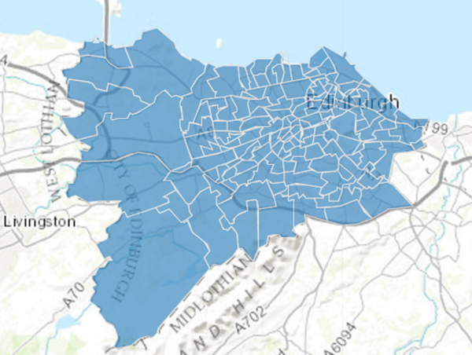


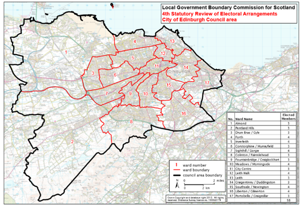

We noticed that each polling location was assigned to a zip code. We therefore used the zip code of the polling districts in order to map back to ward. As some wards had numerous polling districts within them, we used the zip code with the largest number of occurrences in the ward (as long as the zip code was from EH1-16 - our area of interest). For example if the ward "Almond" has 4 zip codes in EH4 and only 1 in EH2 we considered Almond to be part of EH4. 

As some zip codes are really small such as EH1 and EH2, there are some zip codes that were not assigned to any single ward using the method above. For those zip codes we found wards that contained that zip divided the population numbers in two and assigned half of the population in the ward to each of the two zip codes. For example the ward central city in general encompass EH1 and EH2. So we split the population for central city into two by half and assign it to the population of EH1 and EH2.   Income and property prices remained the same.

We also downloaded data on all the hotels in Edinburgh from booking.com. We cleansed this data to extract the zip code so that the data will be useful.


```{r eval=FALSE}

import json
import pandas as pd
from glob import glob

def convert(x):
    ''' Convert a json string to a flat python dictionary
    which can be passed into Pandas. '''
    ob = json.loads(x)
    for k, v in ob.items():
        if isinstance(v, list):
            ob[k] = ','.join(v)
        elif isinstance(v, dict):
            for kk, vv in v.items():
                ob['%s_%s' % (k, kk)] = vv
            del ob[k]
    return ob


def convert2(x):
    ''' Convert a json string to a flat python dictionary
    which can be passed into Pandas. '''
    ob = json.loads(x)
    for k, v in ob.items():
        if isinstance(v, list):
            ob[k] = ','.join(str(v))
        elif isinstance(v, dict):
            for kk, vv in v.items():
                ob['%s_%s' % (k, kk)] = vv
            del ob[k]
    return ob

business = pd.DataFrame([convert(line) for line in file("yelp_academic_dataset_business.json")])
checkin = pd.DataFrame([convert(line) for line in file("yelp_academic_dataset_checkin.json")])
review = pd.DataFrame([convert(line) for line in file("yelp_academic_dataset_review.json")])
tip = pd.DataFrame([convert(line) for line in file("yelp_academic_dataset_tip.json")])
user = pd.DataFrame([convert2(line) for line in file("yelp_academic_dataset_user.json")])

cusine = ['Scottish', 'Mediterranean','Chinese','French','Italian', 'Thai',  'Indian', 'British', 'European', 'Greek', 'Nepalese', 'German', 'Turkish', 'Mexican', 'Pakistan', 'Seafood', 'Japanese', 'Vegetarian', 'Brazilian', 'American','Spanish','Bakeries', 'Gastropubs', 'Soup','Caterers','Cafes','Smoothies','Bistros','Pubs', 'Coffee & Tea','Burgers', 'Delis','Fast Food', 'Sandwiches', 'Pizza', 'Fish & Chips', 'Polish', 'African', 'Korean', 'Middle Eastern', 'Creperies', 'Brasseries','Chicken Wings'  ]

def cusineCategory(x):
    for cus in cusine:
        category = x.categories.encode('ascii','ignore')
        if cus in category:
            return cus

def getZip(x, name):
    start= x[name].find("EH")
    Zip = x[name][start:start + 4].replace(" ", "")
    return Zip
   

edinburgh = business[business.city == "Edinburgh"]
edinburgh = edinburgh[edinburgh['categories'].str.contains("Restaurants")]
edinburgh['cusine'] = edinburgh.apply(cusineCategory, axis = 1)
edinburgh['zip'] = edinburgh.apply(getZip,args=('full_address',),axis=1)
edinburgh = edinburgh[edinburgh.zip != "EH17"]
edinburghid = pd.DataFrame(edinburgh.business_id)
edinReview = pd.merge(edinburghid,review, how='left' ,on="business_id")
edinCheckin = pd.merge(edinburghid,checkin, how='left' ,on="business_id")
edinTip = pd.merge(edinburghid,tip, how='left' ,on="business_id")

edinUserIds = pd.concat([edinReview.user_id,edinTip.user_id])
uniqueIds = pd.DataFrame(edinUserIds.unique())
uniqueIds.columns = ['user_id']

edinUsers = pd.merge(uniqueIds,user, how = 'left' , on = 'user_id')

edinburgh.to_csv('edinburgh.csv', encoding = 'utf-8')
edinReview.to_csv('edinReview.csv', encoding = 'utf-8')
edinCheckin.to_csv('edinCheckin.csv', encoding = 'utf-8')
edinTip.to_csv('edinTip.csv',encoding = 'utf-8')
edinUsers.to_csv('edinUser.csv',encoding='utf-8')


polling = pd.read_csv('polling.csv')
polling['zip'] = polling.apply(getZip,args=('POSTCODE',),axis=1)
polling = polling[['NEWWARD','zip']]
pollGroup = polling.groupby(['NEWWARD','zip']).size().sort_values(ascending=False)
pollGroup

wardsList = ['Almond' , 'Drum Brae Gyle' ,'Pentland Hills', 'Forth' , 'Forth.1', 'Inverleith' , 'Corstorphine Murrayfield' , 'Sighthill Gorgie' , 'Colinton Fairmilehead' , 'Fountainbridge Craiglockhart' , 'Meadows Morningside' , 'City Centre' ,'City Centre.1', 'Leith Walk' , 'Leith ' , 'Craigentinny Duddingston' , 'Southside Newington' ,'Southside Newington.1','Liberton Gilmerton' , 'Portobello Craigmillar']
wards = pd.read_csv('rawwards.csv')
wards['Forth.1'] = wards['Forth']
wards['Forth.1'][0] = "EH5"
wards['Forth.1'][1:17]= pd.to_numeric(wards['Forth'][1:17], errors='coerce')/2
wards['Forth'][1:17] = wards['Forth.1'][1:17]
wards['Southside Newington.1'] = wards['Southside Newington']
wards['Southside Newington.1'][0] = "EH9"
wards['Southside Newington.1'][1:17]= pd.to_numeric(wards['Southside Newington'][1:17], errors='coerce')/2
wards['Southside Newington'][1:17] = wards['Southside Newington'][1:17]
wards['City Centre.1'] = wards['City Centre']
wards['City Centre.1'][0] = "EH2"
wards['City Centre.1'][1:17]= pd.to_numeric(wards['City Centre'][1:17], errors='coerce')/2
wards['City Centre'][1:17] = wards['City Centre.1'][1:17]
wardsMelt = pd.melt(wards, id_vars=['Indicator'], value_vars=wardsList)


zipCode= ""
wardName = ""
wardsMelt['Zip'] = ""
for i, row in wardsMelt.iterrows():
    if row['Indicator'] == 'Zip':
        zipCode = row['value']
    wardsMelt['Zip'][i] = zipCode
    
wardsMelt = wardsMelt[wardsMelt.Indicator != 'Zip']
wardsMelt.columns = ['indicator','type','value','Zip']
wardsMelt[wardsMelt['type'] == 'City Centre']
wardsMelt.to_csv('edinPopulation.csv')

```

## Analysis
We used Tableau to undertake an initial exploratory data analysis. Figure 3 below shows the number of stores in Edinburgh. Figure 4 shows the type of cuisine that has the most stores. We noticed that in general, Italian and British cuisine are the most popular. The city centre (zip codes EH1 and EH2) contained the greatest number of restaurants.


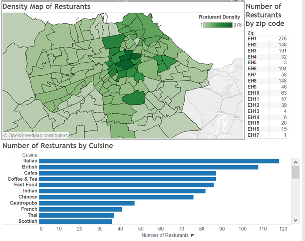

We also looked at the relationship between cuisine type and the number of reviewed. We decided to use the amount of reviews for a restaurant as an indicator of the number of visitors. We decided against using the number of users as an indicator because a user can visit a restaurant twice and give two reviews which will be counted as two visits. This information was then used as an estimate of demand within each zip code.


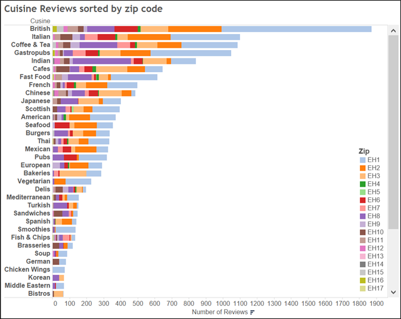

Figure 5  shows that British food has a very high number of reviews in Edinburgh, combined with the knowledge that there are more Italian than British restaurant in general, it might show that British restaurants are quite popular. 

In certain places, such as EH2 which is shown below in Figure 6 shows that there are more Italian than British restaurants and so we can capitalize on the lack of British food to open a British restaurant there.

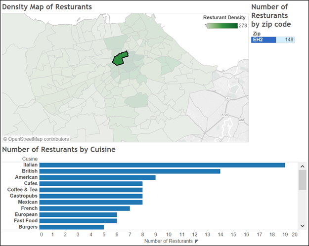

Interestingly, the restaurants in the city centre (EH1 and EH2) had the lowest rating average rating (Figure 7).  An explanation for this is that there are many restaurants in the city centre and hence many low scores pull down the overall average. From this we can potentially infer that if our restaurant wants to focus on ratings, we should not try to put our restaurant in the city centre.

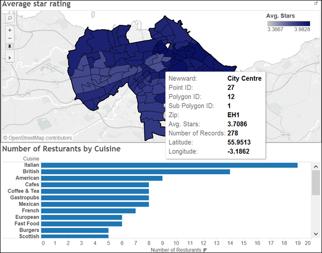

We  decided to calculate the demand using the number of reviews. We understand the number of reviews may not be the best indicator of how many customers a restaurant had, but it served as a good proxy in the absence of more concrete data. Figure 8 shows that the locations with the most reviews are EH1, EH2, EH3 and EH8. We used this information in order to focus our analysis on these areas.


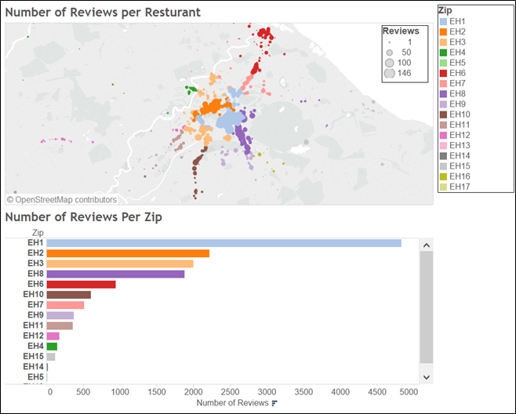

We generated metrics for each zip code (table 1). We considered the ratios of: total population per zip to number of restaurants per zip; average income per zip to the number of restaurants per zip; the total number of properties to the number of restaurants per zip; and the total number of hotels to the number of restaurants per zip. 

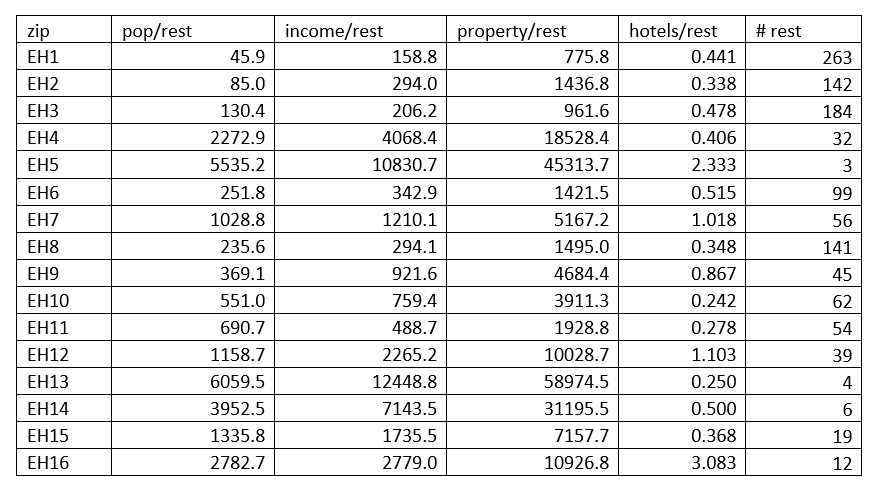


The results of our exploratory analysis led us to choose to build a restaurant at a central location (EH1, EH2, EH3 and EH8). We refer to these areas as our "candidate areas".  EH8 has the largest ratio of population to restaurants compared to the other candidate areas. However, it also has the lowest number of hotels per restaurant. This may mean that there are fewer tourists in the area (who we may wish to attend our restaurant). In contrast, EH3 has attractive population to restaurant and  hotel to restaurant ratios. Furthermore, its property value to restaurant ratio is low potentially making it not too expensive to buy a restaurant there. 

##Recommendation

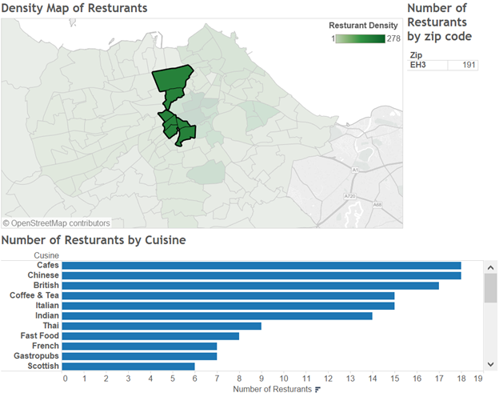


As mention in the analysis, we decided that we will focus on the zip code of EH3. As shown above in Figure 9, British cuisine is not too saturated as there are actually more Chinese restaurants than British restaurants and also a lot of Indian Italian and Thai restaurants. Further using Figure 5, British restaurants seems to be the most popular and hence we should capitalize on the popularity. 

Using the topic modeling method, two recommendations we found is customers are not satisfied with the type of batter for fish and chips in Edinburgh, which was complained to be too soggy and customers are also not particularly happy with chicken dishes in Edinburgh. Therefore in EH3, we should focus on being really good at making chicken as well as Fish. We further recommend that "Chicken and Fish" are the only food offered in the restaurant so that we can specialize in making it good.

##Potential Revenue

In order to calculate potential revenue, we have  estimated the amount of customers a restaurant may receive. 
In order to do this we first considered the check-in dataset. However, we realised that it did not provide a good estimate of the number of customers as check-ins are based on the amount of offers and so represent a biased value for our analysis. The Yelp site [3] states that "Certain businesses offer discounts when yelpers check in to that business" and further states "You check in with the yelp app on an iPhone/iPad or Android device. You have to be within a close proximity to a location to check-in and the app used your phones GPS to measure your location." Hence it is likely that most of the customer visits will not have a check-in event (even if the customer came from Yelp) as the customer will most likely not open the application and check-in. 
We therefore decided to use a mutliple of the number of reviews for a british restaurant as an indicator for the number of visitors.(figure 10) We assumed that the number of reviews indicate approximately .1% of total visits. For Eh3 there are 161 reviews for British restaurant and 17 British restaurants in total and hence there are 9.47average number of Reviews per British Restaurant for Eh3.We can expect that for a year there will be around 9470 customers per year (9.47 * 1000). 


For pricing, we decide to take the average price for British Cusine at Eh3. As shown in figure10 below the average price range is around 2.53.

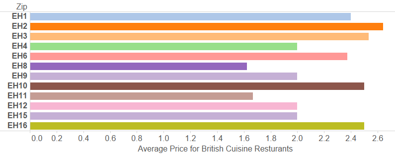

 We used data on prices obtained from the Yelp site in order to calculate our expected revenue at a given level of price. The mapping of Yelp price symbols to dollar ($) value is given in table 3.


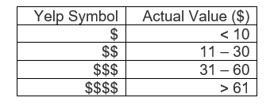


2.5 is between the second price range and the third price range so we decided to use the average price of 30 dollars. We calculated that if we open a restaurant with a Yelp price range of 2.5 we can expect to make 9470 * 2.5 which is $284,100 per year. 

##References
1.	Edinburgh ward and locality demographics. Sourced on June 9th 2016 from http://www.edinburgh.gov.uk/info/20247/edinburgh_by_numbers/1393/locality_and_ward_data_profiles
2.	City of Edinburgh Mapping Portal. Source on June 9th 2016 from http://data.edinburghcouncilmaps.info/datasets/2cee9b18a21344b0879c3c51d71fd2c6_28
3.	Yelp price symbol mapping to real values. Sources on [add date] from http://www.yelp.com/topic/san-diego-can-anyone-give-me-the-actual-dollar-range-for-the-dollar-sign-symbols-in-rrgards-to-pricing
